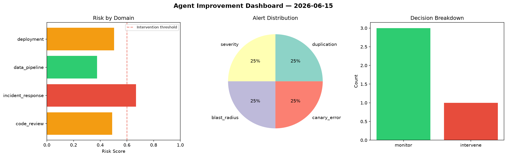
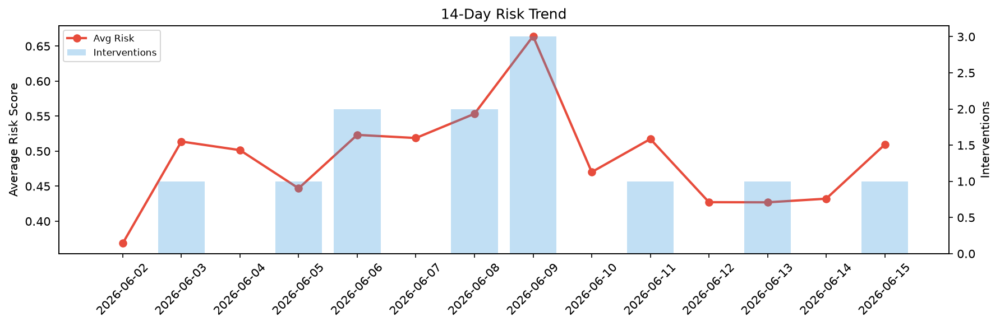

# Agent Improvement Report — 2026-06-15

**Cycle ID:** `ec6b368f` | **Avg Risk:** 0.5095 | **Interventions:** 1/4

## Risk Matrix

| Domain | Risk Score | Decision | Alerts |
|--------|-----------|----------|--------|
| code_review | 0.4897 | monitor | duplication |
| incident_response | 0.6679 | intervene | severity, blast_radius |
| data_pipeline | 0.3765 | monitor | none |
| deployment | 0.5038 | monitor | canary_error |

## Delta vs Yesterday

| Domain | Today | Yesterday | Change |
|--------|-------|-----------|--------|
| code_review | 0.4897 | 0.3496 | 📈 40.1% |
| incident_response | 0.6679 | 0.4916 | 📈 35.9% |
| data_pipeline | 0.3765 | 0.442 | 📉 -14.8% |
| deployment | 0.5038 | 0.4455 | 📈 13.1% |

**Refinement:** `{'adjustment': 'tighten_thresholds', 'trend': 'degrading', 'window': 4}`