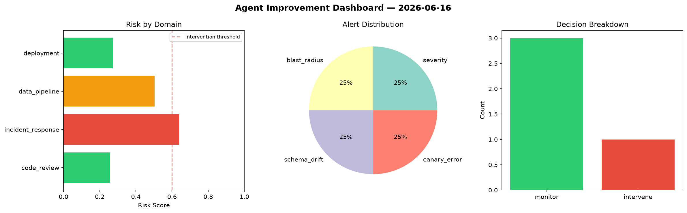
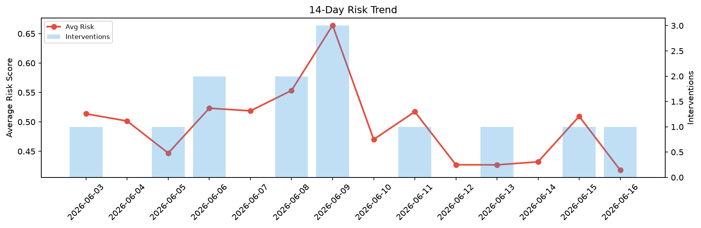

# Agent Improvement Report — 2026-06-16

**Cycle ID:** `0f99466a` | **Avg Risk:** 0.418 | **Interventions:** 1/4

## Risk Matrix

| Domain | Risk Score | Decision | Alerts |
|--------|-----------|----------|--------|
| code_review | 0.2559 | monitor | none |
| incident_response | 0.6398 | intervene | severity, blast_radius |
| data_pipeline | 0.5037 | monitor | schema_drift |
| deployment | 0.2728 | monitor | canary_error |

## Delta vs Yesterday

| Domain | Today | Yesterday | Change |
|--------|-------|-----------|--------|
| code_review | 0.2559 | 0.4897 | 📉 -47.7% |
| incident_response | 0.6398 | 0.6679 | 📉 -4.2% |
| data_pipeline | 0.5037 | 0.3765 | 📈 33.8% |
| deployment | 0.2728 | 0.5038 | 📉 -45.9% |

**Refinement:** `{'adjustment': 'tighten_thresholds', 'trend': 'degrading', 'window': 4}`