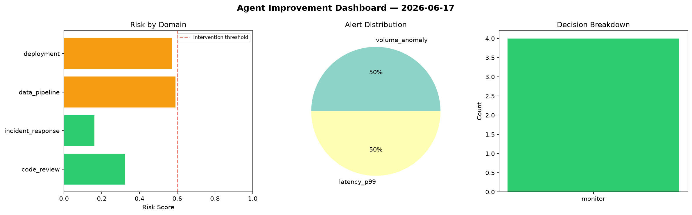
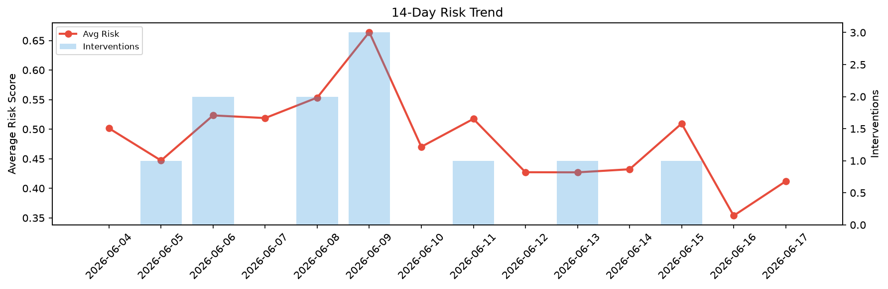

# Agent Improvement Report — 2026-06-17

**Cycle ID:** `67d9936b` | **Avg Risk:** 0.4119 | **Interventions:** 0/4

## Risk Matrix

| Domain | Risk Score | Decision | Alerts |
|--------|-----------|----------|--------|
| code_review | 0.3224 | monitor | none |
| incident_response | 0.1616 | monitor | none |
| data_pipeline | 0.5911 | monitor | volume_anomaly |
| deployment | 0.5724 | monitor | latency_p99 |

## Delta vs Yesterday

| Domain | Today | Yesterday | Change |
|--------|-------|-----------|--------|
| code_review | 0.3224 | 0.3553 | 📉 -9.3% |
| incident_response | 0.1616 | 0.3445 | 📉 -53.1% |
| data_pipeline | 0.5911 | 0.2647 | 📈 123.3% |
| deployment | 0.5724 | 0.4503 | 📈 27.1% |

**Refinement:** `{'adjustment': 'tighten_thresholds', 'trend': 'degrading', 'window': 4}`