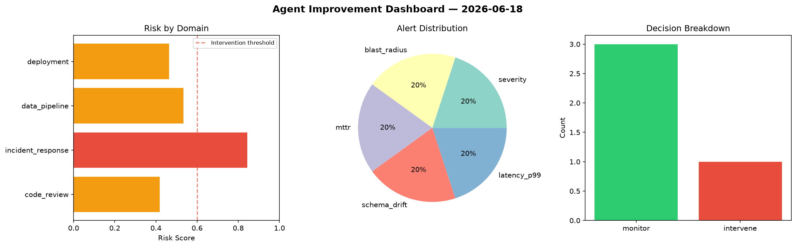
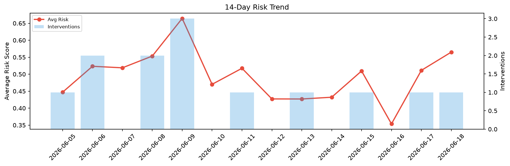

# Agent Improvement Report — 2026-06-18

**Cycle ID:** `54ead5ac` | **Avg Risk:** 0.565 | **Interventions:** 1/4

## Risk Matrix

| Domain | Risk Score | Decision | Alerts |
|--------|-----------|----------|--------|
| code_review | 0.419 | monitor | none |
| incident_response | 0.8436 | intervene | severity, blast_radius, mttr |
| data_pipeline | 0.5332 | monitor | schema_drift |
| deployment | 0.4641 | monitor | latency_p99 |

## Delta vs Yesterday

| Domain | Today | Yesterday | Change |
|--------|-------|-----------|--------|
| code_review | 0.419 | 0.8187 | 📉 -48.8% |
| incident_response | 0.8436 | 0.3812 | 📈 121.3% |
| data_pipeline | 0.5332 | 0.5894 | 📉 -9.5% |
| deployment | 0.4641 | 0.256 | 📈 81.3% |

**Refinement:** `{'adjustment': 'tighten_thresholds', 'trend': 'degrading', 'window': 4}`