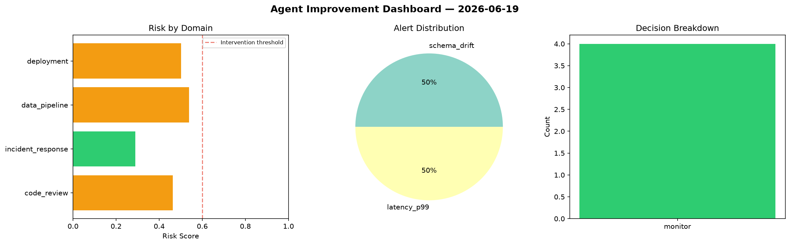
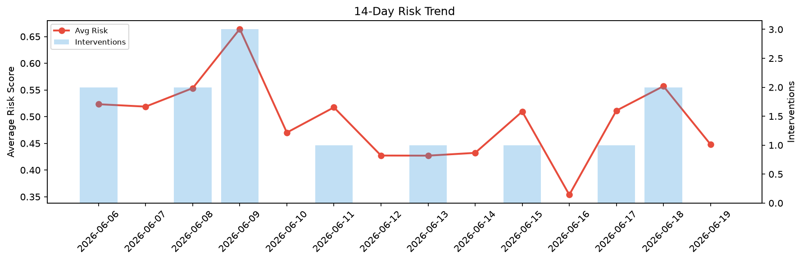

# Agent Improvement Report — 2026-06-19

**Cycle ID:** `145e7596` | **Avg Risk:** 0.4481 | **Interventions:** 0/4

## Risk Matrix

| Domain | Risk Score | Decision | Alerts |
|--------|-----------|----------|--------|
| code_review | 0.4633 | monitor | none |
| incident_response | 0.2893 | monitor | none |
| data_pipeline | 0.5379 | monitor | schema_drift |
| deployment | 0.5019 | monitor | latency_p99 |

## Delta vs Yesterday

| Domain | Today | Yesterday | Change |
|--------|-------|-----------|--------|
| code_review | 0.4633 | 0.6066 | 📉 -23.6% |
| incident_response | 0.2893 | 0.5901 | 📉 -51.0% |
| data_pipeline | 0.5379 | 0.6439 | 📉 -16.5% |
| deployment | 0.5019 | 0.3879 | 📈 29.4% |

**Refinement:** `{'adjustment': 'tighten_thresholds', 'trend': 'degrading', 'window': 4}`