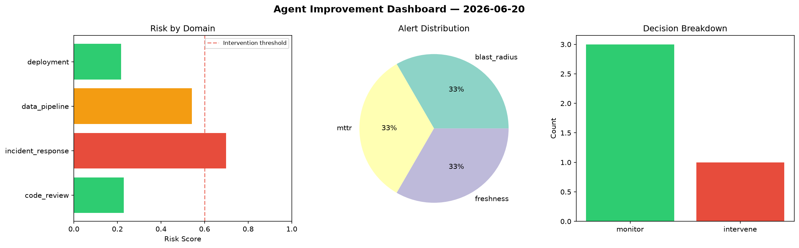
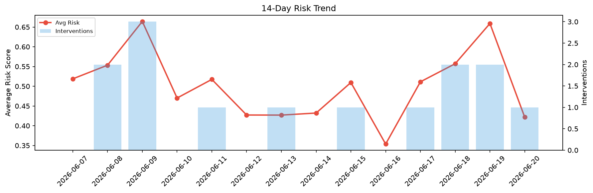

# Agent Improvement Report — 2026-06-20

**Cycle ID:** `2ca375f4` | **Avg Risk:** 0.4218 | **Interventions:** 1/4

## Risk Matrix

| Domain | Risk Score | Decision | Alerts |
|--------|-----------|----------|--------|
| code_review | 0.2297 | monitor | none |
| incident_response | 0.6994 | intervene | blast_radius, mttr |
| data_pipeline | 0.5409 | monitor | freshness |
| deployment | 0.2172 | monitor | none |

## Delta vs Yesterday

| Domain | Today | Yesterday | Change |
|--------|-------|-----------|--------|
| code_review | 0.2297 | 0.4668 | 📉 -50.8% |
| incident_response | 0.6994 | 0.5771 | 📈 21.2% |
| data_pipeline | 0.5409 | 0.774 | 📉 -30.1% |
| deployment | 0.2172 | 0.8182 | 📉 -73.5% |

**Refinement:** `{'adjustment': 'maintain', 'trend': 'improving', 'window': 4}`