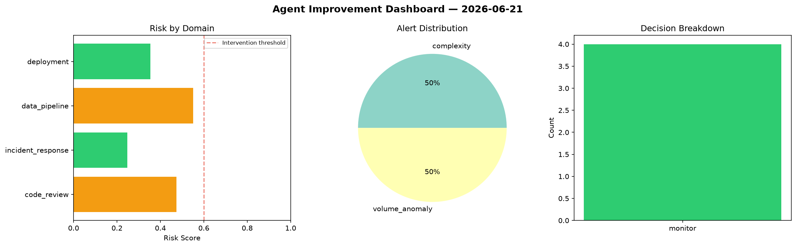
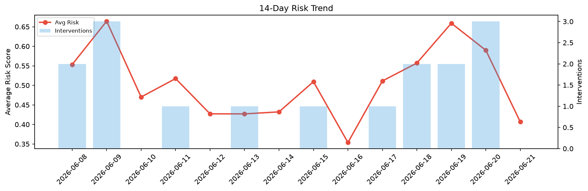

# Agent Improvement Report — 2026-06-21

**Cycle ID:** `8bff0680` | **Avg Risk:** 0.4065 | **Interventions:** 0/4

## Risk Matrix

| Domain | Risk Score | Decision | Alerts |
|--------|-----------|----------|--------|
| code_review | 0.4746 | monitor | complexity |
| incident_response | 0.2471 | monitor | none |
| data_pipeline | 0.5505 | monitor | volume_anomaly |
| deployment | 0.3539 | monitor | none |

## Delta vs Yesterday

| Domain | Today | Yesterday | Change |
|--------|-------|-----------|--------|
| code_review | 0.4746 | 0.7628 | 📉 -37.8% |
| incident_response | 0.2471 | 0.3659 | 📉 -32.5% |
| data_pipeline | 0.5505 | 0.6075 | 📉 -9.4% |
| deployment | 0.3539 | 0.6233 | 📉 -43.2% |

**Refinement:** `{'adjustment': 'maintain', 'trend': 'improving', 'window': 4}`