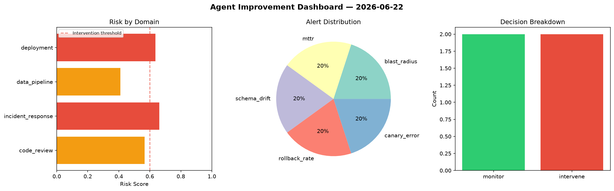
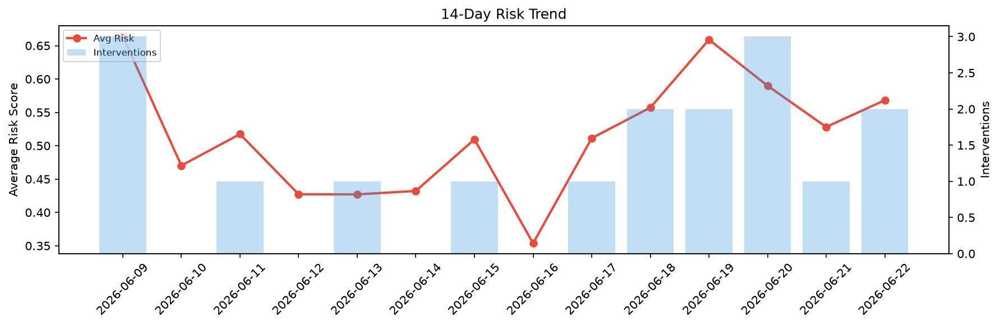

# Agent Improvement Report — 2026-06-22

**Cycle ID:** `db2fa21f` | **Avg Risk:** 0.5682 | **Interventions:** 2/4

## Risk Matrix

| Domain | Risk Score | Decision | Alerts |
|--------|-----------|----------|--------|
| code_review | 0.5657 | monitor | none |
| incident_response | 0.6617 | intervene | blast_radius, mttr |
| data_pipeline | 0.4096 | monitor | schema_drift |
| deployment | 0.6357 | intervene | rollback_rate, canary_error |

## Delta vs Yesterday

| Domain | Today | Yesterday | Change |
|--------|-------|-----------|--------|
| code_review | 0.5657 | 0.4632 | 📈 22.1% |
| incident_response | 0.6617 | 0.2881 | 📈 129.7% |
| data_pipeline | 0.4096 | 0.8532 | 📉 -52.0% |
| deployment | 0.6357 | 0.5077 | 📈 25.2% |

**Refinement:** `{'adjustment': 'tighten_thresholds', 'trend': 'degrading', 'window': 4}`