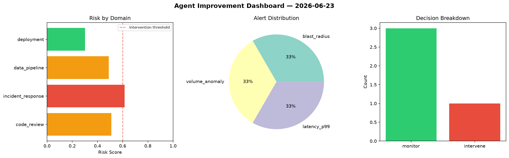
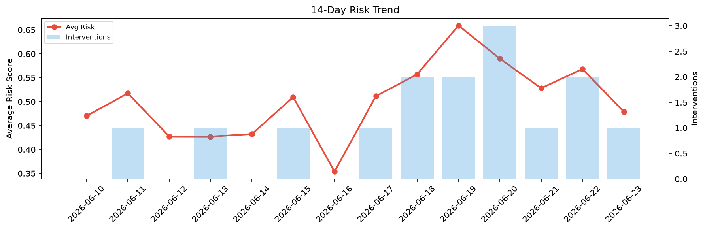

# Agent Improvement Report — 2026-06-23

**Cycle ID:** `520440f7` | **Avg Risk:** 0.4789 | **Interventions:** 1/4

## Risk Matrix

| Domain | Risk Score | Decision | Alerts |
|--------|-----------|----------|--------|
| code_review | 0.5105 | monitor | none |
| incident_response | 0.615 | intervene | blast_radius |
| data_pipeline | 0.4891 | monitor | volume_anomaly |
| deployment | 0.3011 | monitor | latency_p99 |

## Delta vs Yesterday

| Domain | Today | Yesterday | Change |
|--------|-------|-----------|--------|
| code_review | 0.5105 | 0.5657 | 📉 -9.8% |
| incident_response | 0.615 | 0.6617 | 📉 -7.1% |
| data_pipeline | 0.4891 | 0.4096 | 📈 19.4% |
| deployment | 0.3011 | 0.6357 | 📉 -52.6% |

**Refinement:** `{'adjustment': 'maintain', 'trend': 'improving', 'window': 4}`