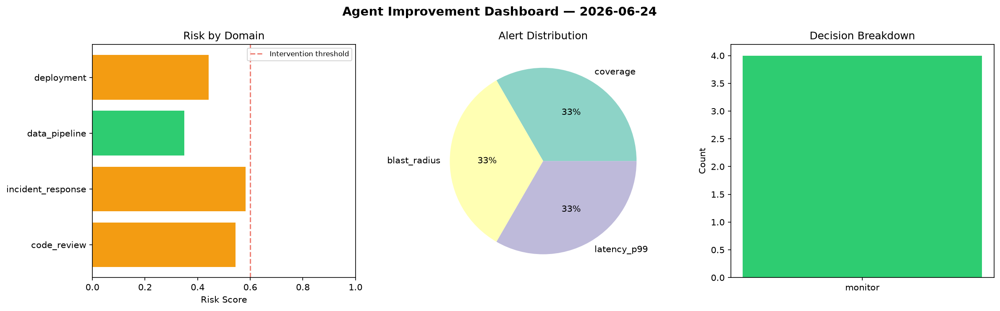
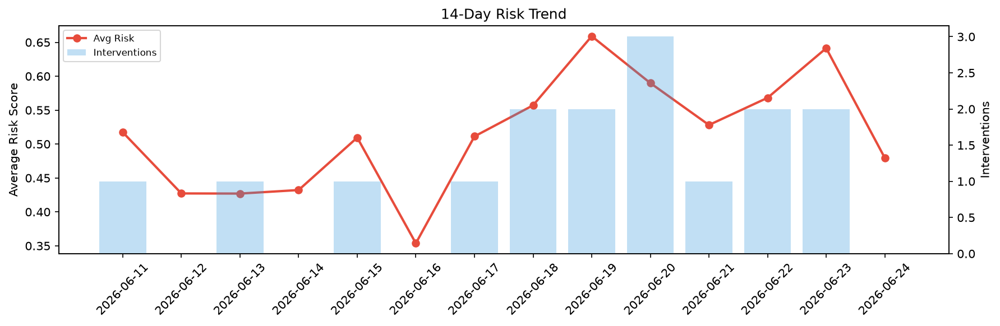

# Agent Improvement Report — 2026-06-24

**Cycle ID:** `5a1677ec` | **Avg Risk:** 0.4795 | **Interventions:** 0/4

## Risk Matrix

| Domain | Risk Score | Decision | Alerts |
|--------|-----------|----------|--------|
| code_review | 0.5434 | monitor | coverage |
| incident_response | 0.583 | monitor | blast_radius |
| data_pipeline | 0.3498 | monitor | none |
| deployment | 0.4417 | monitor | latency_p99 |

## Delta vs Yesterday

| Domain | Today | Yesterday | Change |
|--------|-------|-----------|--------|
| code_review | 0.5434 | 0.7237 | 📉 -24.9% |
| incident_response | 0.583 | 0.5211 | 📈 11.9% |
| data_pipeline | 0.3498 | 0.8107 | 📉 -56.9% |
| deployment | 0.4417 | 0.5096 | 📉 -13.3% |

**Refinement:** `{'adjustment': 'maintain', 'trend': 'improving', 'window': 4}`