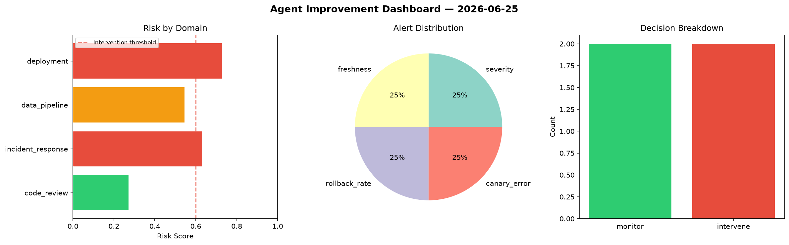
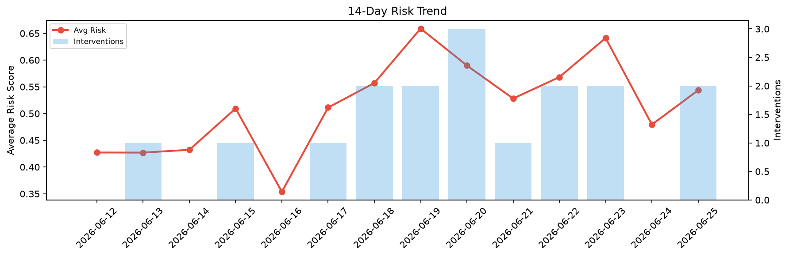

# Agent Improvement Report — 2026-06-25

**Cycle ID:** `c906c972` | **Avg Risk:** 0.5435 | **Interventions:** 2/4

## Risk Matrix

| Domain | Risk Score | Decision | Alerts |
|--------|-----------|----------|--------|
| code_review | 0.2711 | monitor | none |
| incident_response | 0.6309 | intervene | severity |
| data_pipeline | 0.5443 | monitor | freshness |
| deployment | 0.7276 | intervene | rollback_rate, canary_error |

## Delta vs Yesterday

| Domain | Today | Yesterday | Change |
|--------|-------|-----------|--------|
| code_review | 0.2711 | 0.5434 | 📉 -50.1% |
| incident_response | 0.6309 | 0.583 | 📈 8.2% |
| data_pipeline | 0.5443 | 0.3498 | 📈 55.6% |
| deployment | 0.7276 | 0.4417 | 📈 64.7% |

**Refinement:** `{'adjustment': 'tighten_thresholds', 'trend': 'degrading', 'window': 4}`