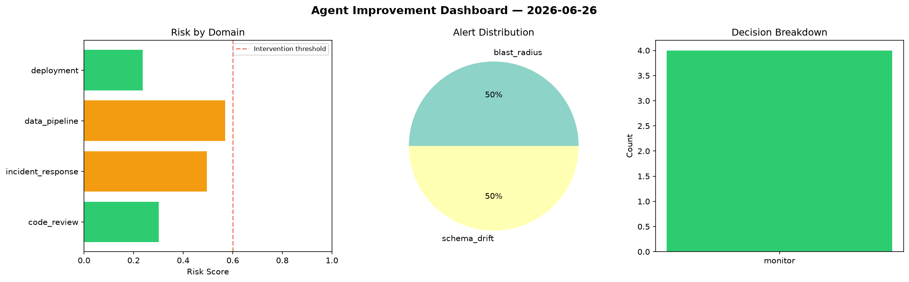
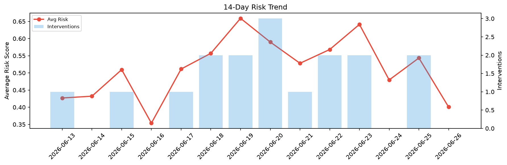

# Agent Improvement Report — 2026-06-26

**Cycle ID:** `296ede27` | **Avg Risk:** 0.4007 | **Interventions:** 0/4

## Risk Matrix

| Domain | Risk Score | Decision | Alerts |
|--------|-----------|----------|--------|
| code_review | 0.3022 | monitor | none |
| incident_response | 0.4955 | monitor | blast_radius |
| data_pipeline | 0.5686 | monitor | schema_drift |
| deployment | 0.2363 | monitor | none |

## Delta vs Yesterday

| Domain | Today | Yesterday | Change |
|--------|-------|-----------|--------|
| code_review | 0.3022 | 0.2711 | 📈 11.5% |
| incident_response | 0.4955 | 0.6309 | 📉 -21.5% |
| data_pipeline | 0.5686 | 0.5443 | 📈 4.5% |
| deployment | 0.2363 | 0.7276 | 📉 -67.5% |

**Refinement:** `{'adjustment': 'maintain', 'trend': 'improving', 'window': 4}`