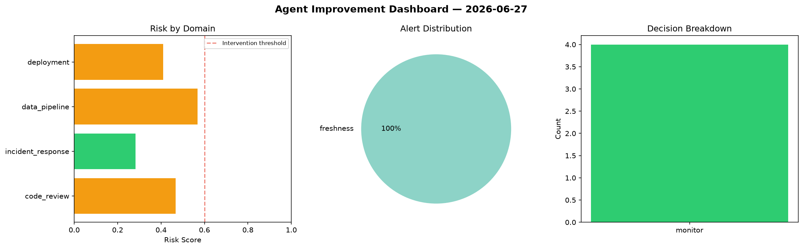
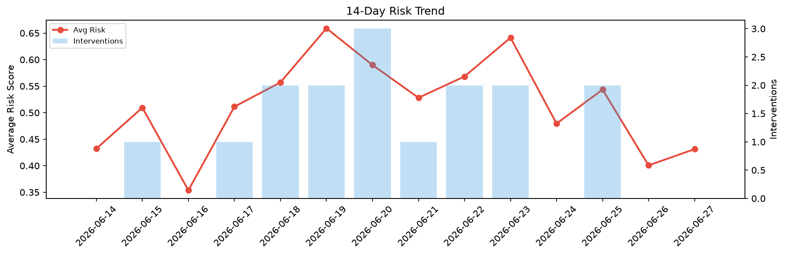

# Agent Improvement Report — 2026-06-27

**Cycle ID:** `7ee8d852` | **Avg Risk:** 0.4313 | **Interventions:** 0/4

## Risk Matrix

| Domain | Risk Score | Decision | Alerts |
|--------|-----------|----------|--------|
| code_review | 0.4665 | monitor | none |
| incident_response | 0.2823 | monitor | none |
| data_pipeline | 0.5674 | monitor | freshness |
| deployment | 0.409 | monitor | none |

## Delta vs Yesterday

| Domain | Today | Yesterday | Change |
|--------|-------|-----------|--------|
| code_review | 0.4665 | 0.3022 | 📈 54.4% |
| incident_response | 0.2823 | 0.4955 | 📉 -43.0% |
| data_pipeline | 0.5674 | 0.5686 | 📉 -0.2% |
| deployment | 0.409 | 0.2363 | 📈 73.1% |

**Refinement:** `{'adjustment': 'maintain', 'trend': 'improving', 'window': 4}`