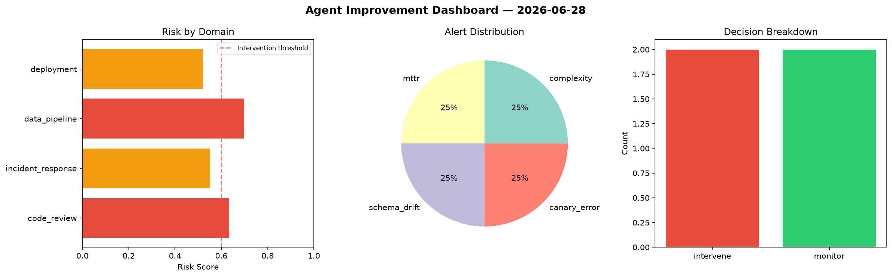
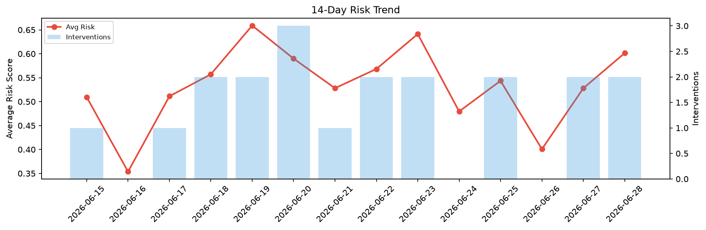

# Agent Improvement Report — 2026-06-28

**Cycle ID:** `2e18507e` | **Avg Risk:** 0.6014 | **Interventions:** 2/4

## Risk Matrix

| Domain | Risk Score | Decision | Alerts |
|--------|-----------|----------|--------|
| code_review | 0.6344 | intervene | complexity |
| incident_response | 0.5507 | monitor | mttr |
| data_pipeline | 0.6991 | intervene | schema_drift |
| deployment | 0.5215 | monitor | canary_error |

## Delta vs Yesterday

| Domain | Today | Yesterday | Change |
|--------|-------|-----------|--------|
| code_review | 0.6344 | 0.4355 | 📈 45.7% |
| incident_response | 0.5507 | 0.3301 | 📈 66.8% |
| data_pipeline | 0.6991 | 0.6583 | 📈 6.2% |
| deployment | 0.5215 | 0.6876 | 📉 -24.2% |

**Refinement:** `{'adjustment': 'maintain', 'trend': 'improving', 'window': 4}`