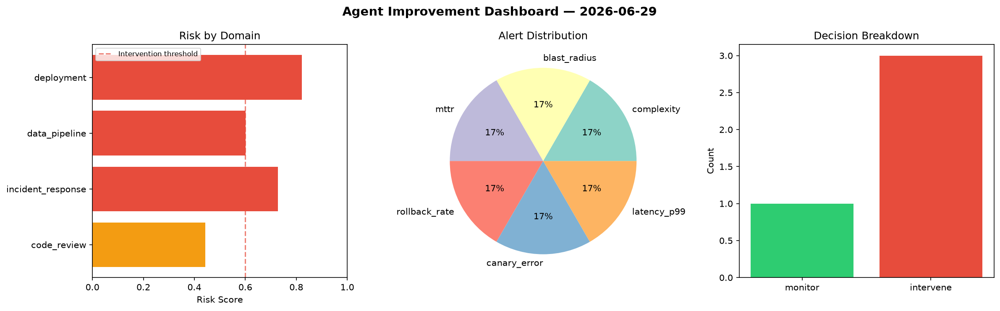
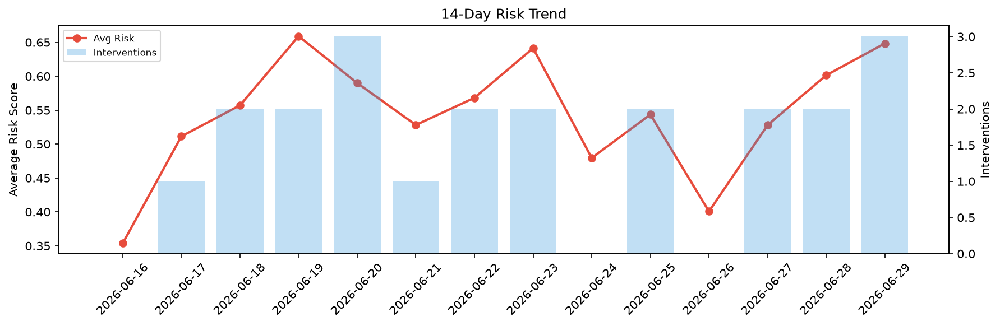

# Agent Improvement Report — 2026-06-29

**Cycle ID:** `773a1e3c` | **Avg Risk:** 0.6483 | **Interventions:** 3/4

## Risk Matrix

| Domain | Risk Score | Decision | Alerts |
|--------|-----------|----------|--------|
| code_review | 0.4423 | monitor | complexity |
| incident_response | 0.7275 | intervene | blast_radius, mttr |
| data_pipeline | 0.6011 | intervene | none |
| deployment | 0.8222 | intervene | rollback_rate, canary_error, latency_p99 |

## Delta vs Yesterday

| Domain | Today | Yesterday | Change |
|--------|-------|-----------|--------|
| code_review | 0.4423 | 0.6344 | 📉 -30.3% |
| incident_response | 0.7275 | 0.5507 | 📈 32.1% |
| data_pipeline | 0.6011 | 0.6991 | 📉 -14.0% |
| deployment | 0.8222 | 0.5215 | 📈 57.7% |

**Refinement:** `{'adjustment': 'tighten_thresholds', 'trend': 'degrading', 'window': 4}`