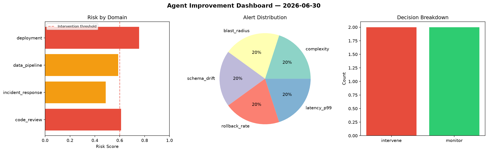
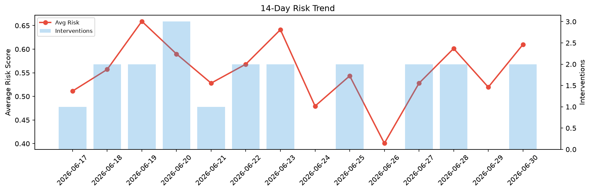

# Agent Improvement Report — 2026-06-30

**Cycle ID:** `2f2afc00` | **Avg Risk:** 0.6099 | **Interventions:** 2/4

## Risk Matrix

| Domain | Risk Score | Decision | Alerts |
|--------|-----------|----------|--------|
| code_review | 0.6105 | intervene | complexity |
| incident_response | 0.4867 | monitor | blast_radius |
| data_pipeline | 0.5872 | monitor | schema_drift |
| deployment | 0.755 | intervene | rollback_rate, latency_p99 |

## Delta vs Yesterday

| Domain | Today | Yesterday | Change |
|--------|-------|-----------|--------|
| code_review | 0.6105 | 0.5573 | 📈 9.5% |
| incident_response | 0.4867 | 0.5264 | 📉 -7.5% |
| data_pipeline | 0.5872 | 0.5177 | 📈 13.4% |
| deployment | 0.755 | 0.4771 | 📈 58.2% |

**Refinement:** `{'adjustment': 'tighten_thresholds', 'trend': 'degrading', 'window': 4}`