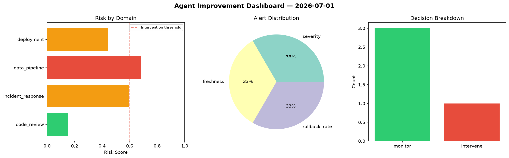
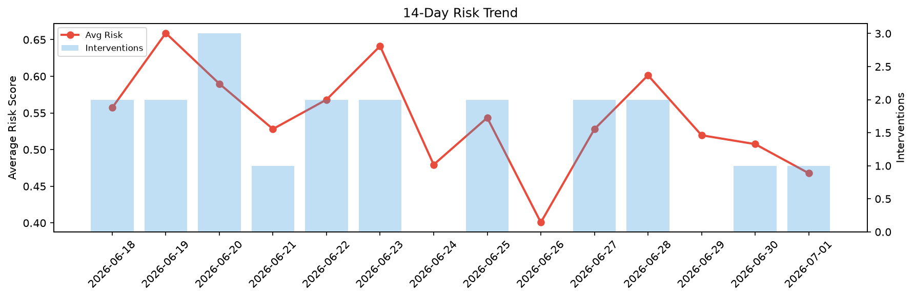

# Agent Improvement Report — 2026-07-01

**Cycle ID:** `909bb74f` | **Avg Risk:** 0.4678 | **Interventions:** 1/4

## Risk Matrix

| Domain | Risk Score | Decision | Alerts |
|--------|-----------|----------|--------|
| code_review | 0.1509 | monitor | none |
| incident_response | 0.5972 | monitor | severity |
| data_pipeline | 0.6809 | intervene | freshness |
| deployment | 0.4422 | monitor | rollback_rate |

## Delta vs Yesterday

| Domain | Today | Yesterday | Change |
|--------|-------|-----------|--------|
| code_review | 0.1509 | 0.8824 | 📉 -82.9% |
| incident_response | 0.5972 | 0.1305 | 📈 357.6% |
| data_pipeline | 0.6809 | 0.5981 | 📈 13.8% |
| deployment | 0.4422 | 0.4191 | 📈 5.5% |

**Refinement:** `{'adjustment': 'tighten_thresholds', 'trend': 'degrading', 'window': 4}`