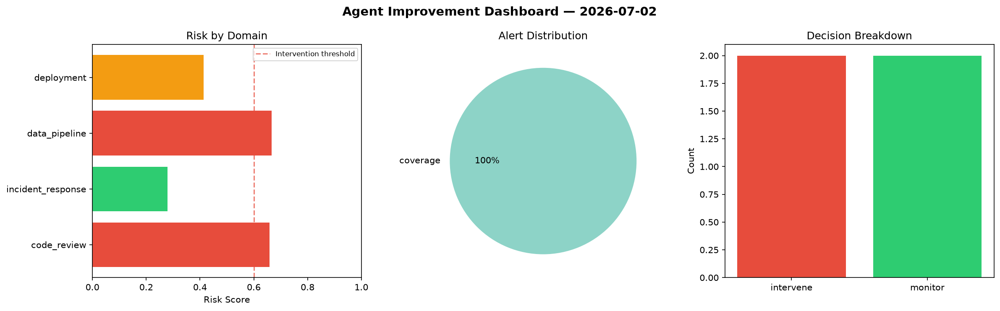
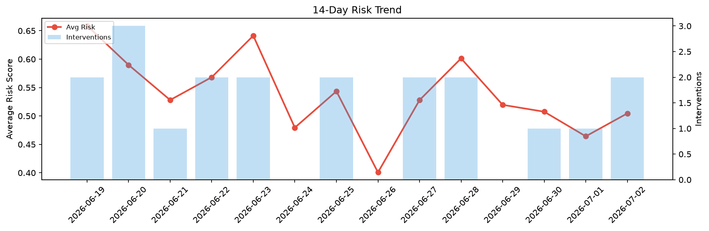

# Agent Improvement Report — 2026-07-02

**Cycle ID:** `788aac49` | **Avg Risk:** 0.5046 | **Interventions:** 2/4

## Risk Matrix

| Domain | Risk Score | Decision | Alerts |
|--------|-----------|----------|--------|
| code_review | 0.6589 | intervene | coverage |
| incident_response | 0.2787 | monitor | none |
| data_pipeline | 0.6669 | intervene | none |
| deployment | 0.414 | monitor | none |

## Delta vs Yesterday

| Domain | Today | Yesterday | Change |
|--------|-------|-----------|--------|
| code_review | 0.6589 | 0.331 | 📈 99.1% |
| incident_response | 0.2787 | 0.3307 | 📉 -15.7% |
| data_pipeline | 0.6669 | 0.5086 | 📈 31.1% |
| deployment | 0.414 | 0.6865 | 📉 -39.7% |

**Refinement:** `{'adjustment': 'maintain', 'trend': 'improving', 'window': 4}`