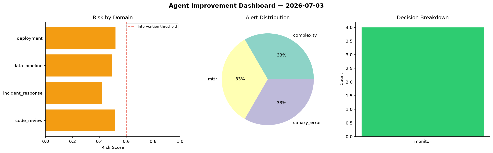
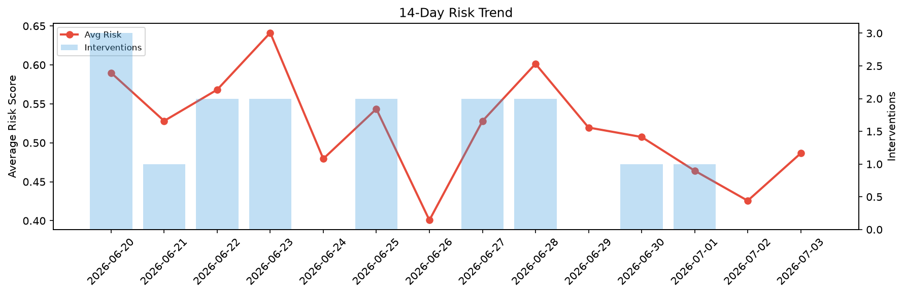

# Agent Improvement Report — 2026-07-03

**Cycle ID:** `93a8600c` | **Avg Risk:** 0.4866 | **Interventions:** 0/4

## Risk Matrix

| Domain | Risk Score | Decision | Alerts |
|--------|-----------|----------|--------|
| code_review | 0.5134 | monitor | complexity |
| incident_response | 0.4214 | monitor | mttr |
| data_pipeline | 0.4918 | monitor | none |
| deployment | 0.5196 | monitor | canary_error |

## Delta vs Yesterday

| Domain | Today | Yesterday | Change |
|--------|-------|-----------|--------|
| code_review | 0.5134 | 0.4008 | 📈 28.1% |
| incident_response | 0.4214 | 0.2939 | 📈 43.4% |
| data_pipeline | 0.4918 | 0.4948 | 📉 -0.6% |
| deployment | 0.5196 | 0.5132 | 📈 1.2% |

**Refinement:** `{'adjustment': 'tighten_thresholds', 'trend': 'degrading', 'window': 4}`