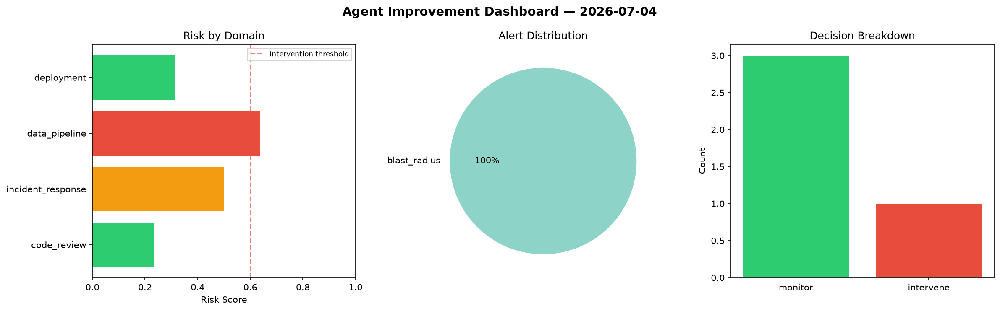
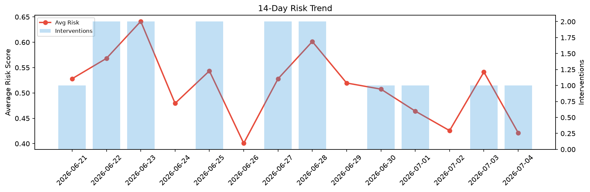

# Agent Improvement Report — 2026-07-04

**Cycle ID:** `4cfeaec8` | **Avg Risk:** 0.4214 | **Interventions:** 1/4

## Risk Matrix

| Domain | Risk Score | Decision | Alerts |
|--------|-----------|----------|--------|
| code_review | 0.236 | monitor | none |
| incident_response | 0.5006 | monitor | blast_radius |
| data_pipeline | 0.6365 | intervene | none |
| deployment | 0.3126 | monitor | none |

## Delta vs Yesterday

| Domain | Today | Yesterday | Change |
|--------|-------|-----------|--------|
| code_review | 0.236 | 0.4461 | 📉 -47.1% |
| incident_response | 0.5006 | 0.4956 | 📈 1.0% |
| data_pipeline | 0.6365 | 0.7661 | 📉 -16.9% |
| deployment | 0.3126 | 0.4573 | 📉 -31.6% |

**Refinement:** `{'adjustment': 'tighten_thresholds', 'trend': 'degrading', 'window': 4}`