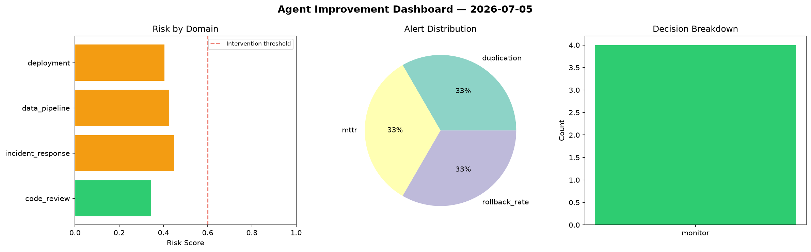
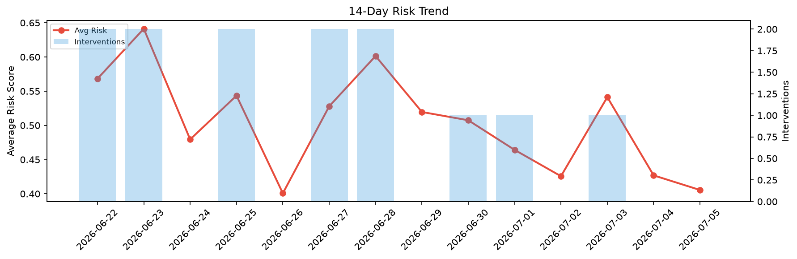

# Agent Improvement Report — 2026-07-05

**Cycle ID:** `ac4efc28` | **Avg Risk:** 0.4055 | **Interventions:** 0/4

## Risk Matrix

| Domain | Risk Score | Decision | Alerts |
|--------|-----------|----------|--------|
| code_review | 0.344 | monitor | duplication |
| incident_response | 0.4475 | monitor | mttr |
| data_pipeline | 0.4262 | monitor | none |
| deployment | 0.4044 | monitor | rollback_rate |

## Delta vs Yesterday

| Domain | Today | Yesterday | Change |
|--------|-------|-----------|--------|
| code_review | 0.344 | 0.3635 | 📉 -5.4% |
| incident_response | 0.4475 | 0.5048 | 📉 -11.4% |
| data_pipeline | 0.4262 | 0.2984 | 📈 42.8% |
| deployment | 0.4044 | 0.5409 | 📉 -25.2% |

**Refinement:** `{'adjustment': 'tighten_thresholds', 'trend': 'degrading', 'window': 4}`