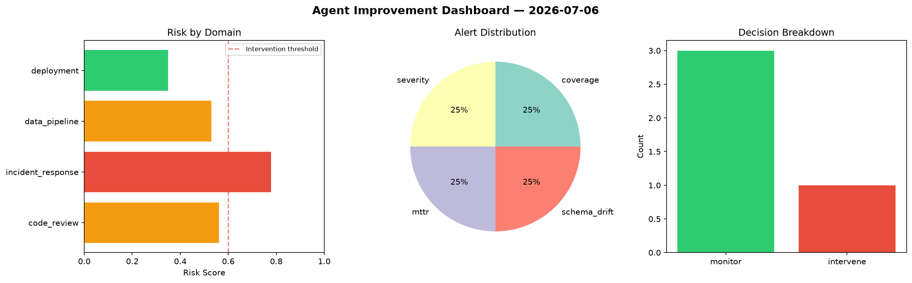
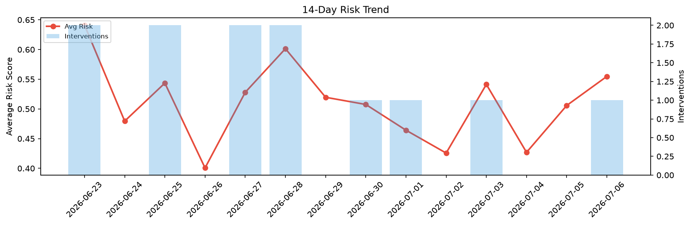

# Agent Improvement Report — 2026-07-06

**Cycle ID:** `10a01e4b` | **Avg Risk:** 0.5548 | **Interventions:** 1/4

## Risk Matrix

| Domain | Risk Score | Decision | Alerts |
|--------|-----------|----------|--------|
| code_review | 0.5622 | monitor | coverage |
| incident_response | 0.779 | intervene | severity, mttr |
| data_pipeline | 0.5288 | monitor | schema_drift |
| deployment | 0.349 | monitor | none |

## Delta vs Yesterday

| Domain | Today | Yesterday | Change |
|--------|-------|-----------|--------|
| code_review | 0.5622 | 0.5447 | 📈 3.2% |
| incident_response | 0.779 | 0.5455 | 📈 42.8% |
| data_pipeline | 0.5288 | 0.4263 | 📈 24.0% |
| deployment | 0.349 | 0.5066 | 📉 -31.1% |

**Refinement:** `{'adjustment': 'maintain', 'trend': 'improving', 'window': 4}`