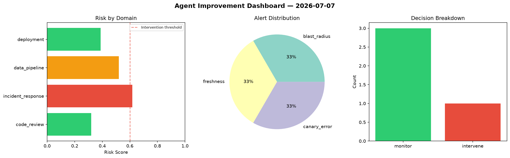
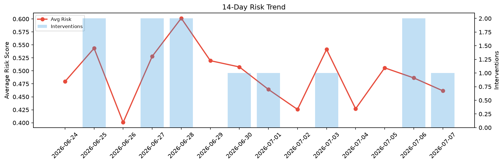

# Agent Improvement Report — 2026-07-07

**Cycle ID:** `68bea99c` | **Avg Risk:** 0.4616 | **Interventions:** 1/4

## Risk Matrix

| Domain | Risk Score | Decision | Alerts |
|--------|-----------|----------|--------|
| code_review | 0.3201 | monitor | none |
| incident_response | 0.6185 | intervene | blast_radius |
| data_pipeline | 0.5205 | monitor | freshness |
| deployment | 0.3874 | monitor | canary_error |

## Delta vs Yesterday

| Domain | Today | Yesterday | Change |
|--------|-------|-----------|--------|
| code_review | 0.3201 | 0.666 | 📉 -51.9% |
| incident_response | 0.6185 | 0.2695 | 📈 129.5% |
| data_pipeline | 0.5205 | 0.6043 | 📉 -13.9% |
| deployment | 0.3874 | 0.4058 | 📉 -4.5% |

**Refinement:** `{'adjustment': 'tighten_thresholds', 'trend': 'degrading', 'window': 4}`