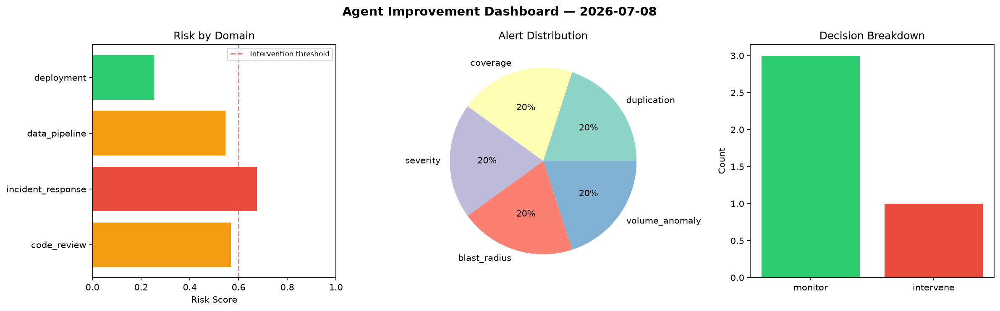
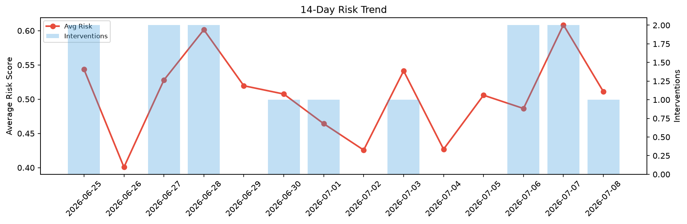

# Agent Improvement Report — 2026-07-08

**Cycle ID:** `ecfac03a` | **Avg Risk:** 0.511 | **Interventions:** 1/4

## Risk Matrix

| Domain | Risk Score | Decision | Alerts |
|--------|-----------|----------|--------|
| code_review | 0.5687 | monitor | duplication, coverage |
| incident_response | 0.6753 | intervene | severity, blast_radius |
| data_pipeline | 0.5461 | monitor | volume_anomaly |
| deployment | 0.2539 | monitor | none |

## Delta vs Yesterday

| Domain | Today | Yesterday | Change |
|--------|-------|-----------|--------|
| code_review | 0.5687 | 0.4333 | 📈 31.2% |
| incident_response | 0.6753 | 0.43 | 📈 57.0% |
| data_pipeline | 0.5461 | 0.8361 | 📉 -34.7% |
| deployment | 0.2539 | 0.7348 | 📉 -65.4% |

**Refinement:** `{'adjustment': 'maintain', 'trend': 'improving', 'window': 4}`