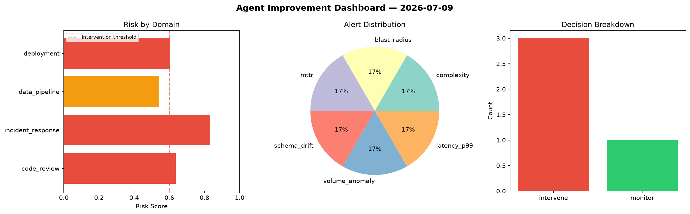
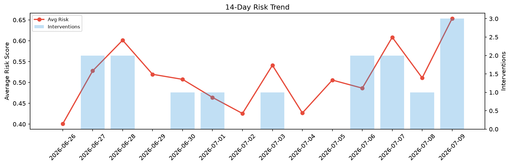

# Agent Improvement Report — 2026-07-09

**Cycle ID:** `5b46fdd8` | **Avg Risk:** 0.6536 | **Interventions:** 3/4

## Risk Matrix

| Domain | Risk Score | Decision | Alerts |
|--------|-----------|----------|--------|
| code_review | 0.6378 | intervene | complexity |
| incident_response | 0.831 | intervene | blast_radius, mttr |
| data_pipeline | 0.5414 | monitor | schema_drift, volume_anomaly |
| deployment | 0.6042 | intervene | latency_p99 |

## Delta vs Yesterday

| Domain | Today | Yesterday | Change |
|--------|-------|-----------|--------|
| code_review | 0.6378 | 0.5687 | 📈 12.2% |
| incident_response | 0.831 | 0.6753 | 📈 23.1% |
| data_pipeline | 0.5414 | 0.5461 | 📉 -0.9% |
| deployment | 0.6042 | 0.2539 | 📈 138.0% |

**Refinement:** `{'adjustment': 'maintain', 'trend': 'improving', 'window': 4}`