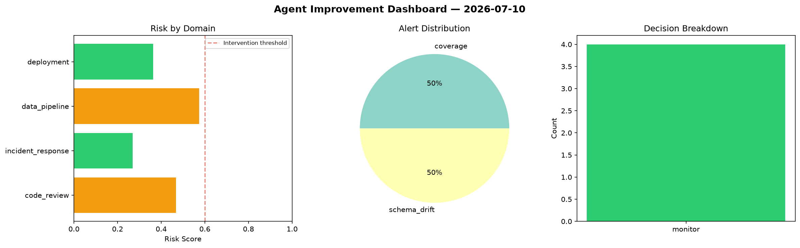
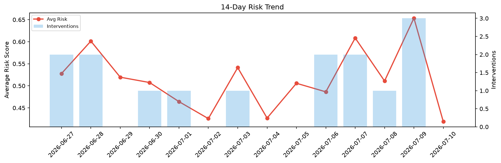

# Agent Improvement Report — 2026-07-10

**Cycle ID:** `35e1114c` | **Avg Risk:** 0.4188 | **Interventions:** 0/4

## Risk Matrix

| Domain | Risk Score | Decision | Alerts |
|--------|-----------|----------|--------|
| code_review | 0.4684 | monitor | coverage |
| incident_response | 0.2687 | monitor | none |
| data_pipeline | 0.5747 | monitor | schema_drift |
| deployment | 0.3634 | monitor | none |

## Delta vs Yesterday

| Domain | Today | Yesterday | Change |
|--------|-------|-----------|--------|
| code_review | 0.4684 | 0.6378 | 📉 -26.6% |
| incident_response | 0.2687 | 0.831 | 📉 -67.7% |
| data_pipeline | 0.5747 | 0.5414 | 📈 6.2% |
| deployment | 0.3634 | 0.6042 | 📉 -39.9% |

**Refinement:** `{'adjustment': 'maintain', 'trend': 'improving', 'window': 4}`