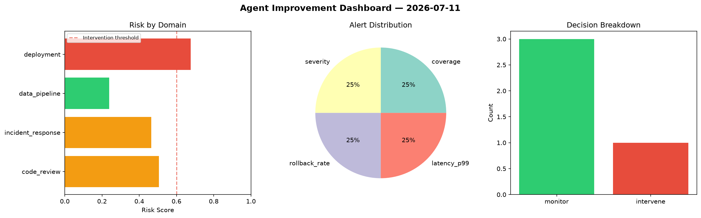
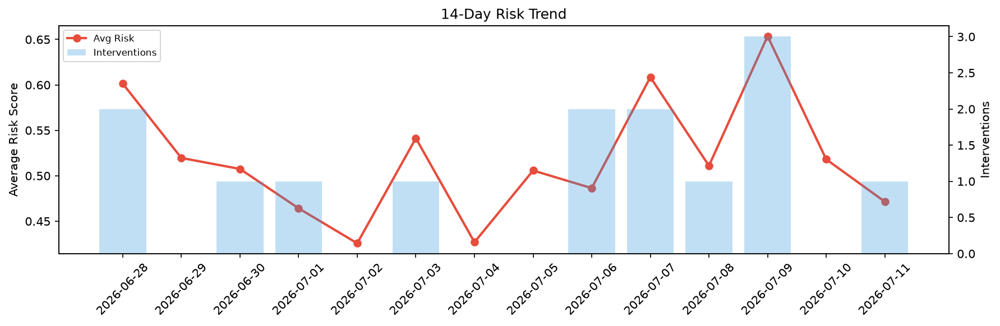

# Agent Improvement Report — 2026-07-11

**Cycle ID:** `9aaeb0bc` | **Avg Risk:** 0.4715 | **Interventions:** 1/4

## Risk Matrix

| Domain | Risk Score | Decision | Alerts |
|--------|-----------|----------|--------|
| code_review | 0.5057 | monitor | coverage |
| incident_response | 0.464 | monitor | severity |
| data_pipeline | 0.2392 | monitor | none |
| deployment | 0.6771 | intervene | rollback_rate, latency_p99 |

## Delta vs Yesterday

| Domain | Today | Yesterday | Change |
|--------|-------|-----------|--------|
| code_review | 0.5057 | 0.434 | 📈 16.5% |
| incident_response | 0.464 | 0.5834 | 📉 -20.5% |
| data_pipeline | 0.2392 | 0.5877 | 📉 -59.3% |
| deployment | 0.6771 | 0.4674 | 📈 44.9% |

**Refinement:** `{'adjustment': 'tighten_thresholds', 'trend': 'degrading', 'window': 4}`