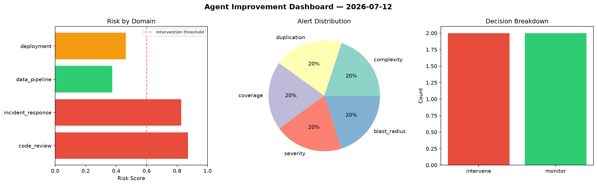
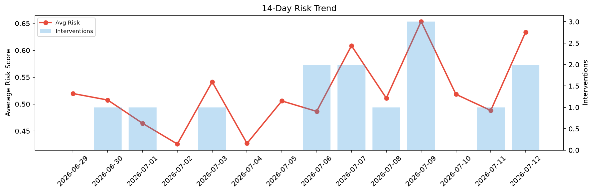

# Agent Improvement Report — 2026-07-12

**Cycle ID:** `6699a7a6` | **Avg Risk:** 0.6337 | **Interventions:** 2/4

## Risk Matrix

| Domain | Risk Score | Decision | Alerts |
|--------|-----------|----------|--------|
| code_review | 0.8711 | intervene | complexity, duplication, coverage |
| incident_response | 0.8265 | intervene | severity, blast_radius |
| data_pipeline | 0.3741 | monitor | none |
| deployment | 0.4632 | monitor | none |

## Delta vs Yesterday

| Domain | Today | Yesterday | Change |
|--------|-------|-----------|--------|
| code_review | 0.8711 | 0.6174 | 📈 41.1% |
| incident_response | 0.8265 | 0.4871 | 📈 69.7% |
| data_pipeline | 0.3741 | 0.5532 | 📉 -32.4% |
| deployment | 0.4632 | 0.2947 | 📈 57.2% |

**Refinement:** `{'adjustment': 'maintain', 'trend': 'improving', 'window': 4}`