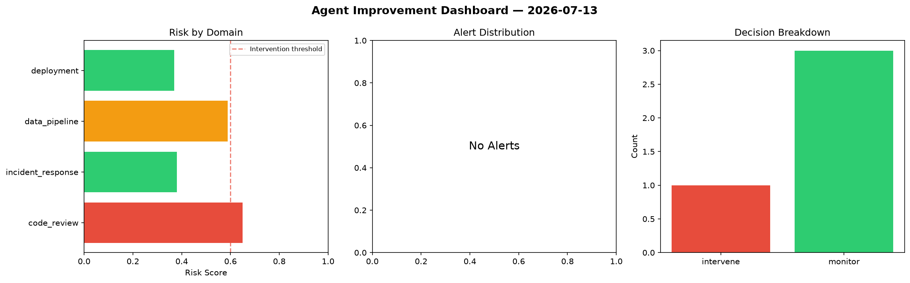
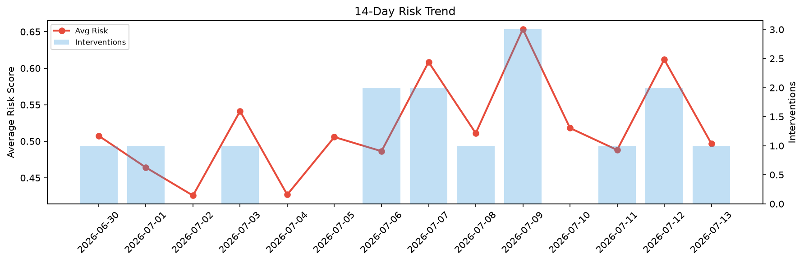

# Agent Improvement Report — 2026-07-13

**Cycle ID:** `dd65c253` | **Avg Risk:** 0.4967 | **Interventions:** 1/4

## Risk Matrix

| Domain | Risk Score | Decision | Alerts |
|--------|-----------|----------|--------|
| code_review | 0.6493 | intervene | none |
| incident_response | 0.3797 | monitor | none |
| data_pipeline | 0.5884 | monitor | none |
| deployment | 0.3694 | monitor | none |

## Delta vs Yesterday

| Domain | Today | Yesterday | Change |
|--------|-------|-----------|--------|
| code_review | 0.6493 | 0.8381 | 📉 -22.5% |
| incident_response | 0.3797 | 0.3748 | 📈 1.3% |
| data_pipeline | 0.5884 | 0.4899 | 📈 20.1% |
| deployment | 0.3694 | 0.7447 | 📉 -50.4% |

**Refinement:** `{'adjustment': 'maintain', 'trend': 'improving', 'window': 4}`