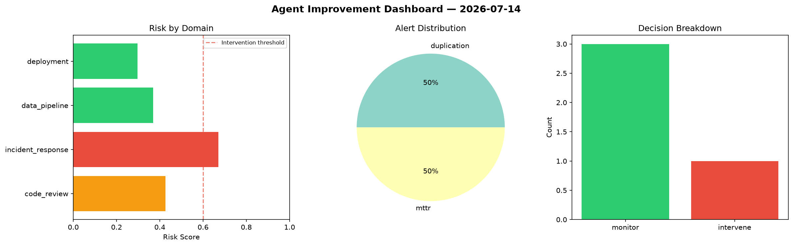
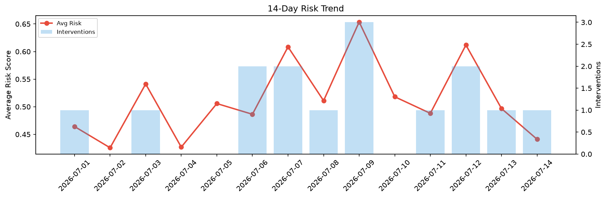

# Agent Improvement Report — 2026-07-14

**Cycle ID:** `9aa3dfa5` | **Avg Risk:** 0.4411 | **Interventions:** 1/4

## Risk Matrix

| Domain | Risk Score | Decision | Alerts |
|--------|-----------|----------|--------|
| code_review | 0.4268 | monitor | duplication |
| incident_response | 0.6705 | intervene | mttr |
| data_pipeline | 0.3698 | monitor | none |
| deployment | 0.2974 | monitor | none |

## Delta vs Yesterday

| Domain | Today | Yesterday | Change |
|--------|-------|-----------|--------|
| code_review | 0.4268 | 0.6493 | 📉 -34.3% |
| incident_response | 0.6705 | 0.3797 | 📈 76.6% |
| data_pipeline | 0.3698 | 0.5884 | 📉 -37.2% |
| deployment | 0.2974 | 0.3694 | 📉 -19.5% |

**Refinement:** `{'adjustment': 'maintain', 'trend': 'improving', 'window': 4}`