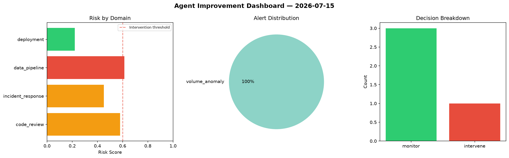
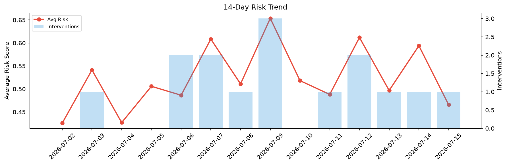

# Agent Improvement Report — 2026-07-15

**Cycle ID:** `94bded4b` | **Avg Risk:** 0.4658 | **Interventions:** 1/4

## Risk Matrix

| Domain | Risk Score | Decision | Alerts |
|--------|-----------|----------|--------|
| code_review | 0.5802 | monitor | none |
| incident_response | 0.4504 | monitor | none |
| data_pipeline | 0.6131 | intervene | volume_anomaly |
| deployment | 0.2196 | monitor | none |

## Delta vs Yesterday

| Domain | Today | Yesterday | Change |
|--------|-------|-----------|--------|
| code_review | 0.5802 | 0.5305 | 📈 9.4% |
| incident_response | 0.4504 | 0.5 | 📉 -9.9% |
| data_pipeline | 0.6131 | 0.5809 | 📈 5.5% |
| deployment | 0.2196 | 0.7646 | 📉 -71.3% |

**Refinement:** `{'adjustment': 'maintain', 'trend': 'improving', 'window': 4}`