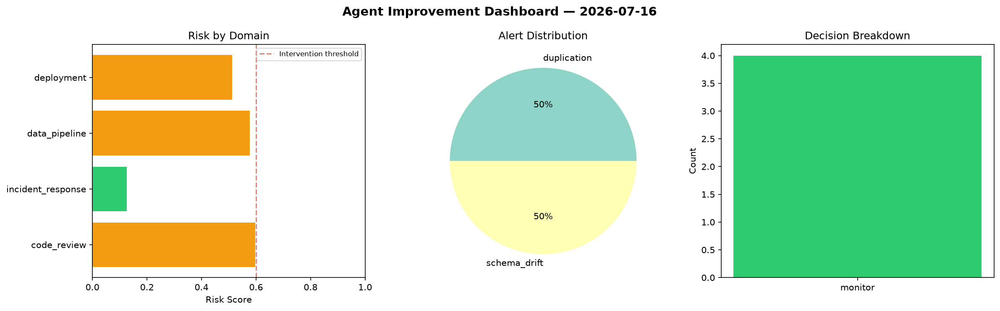
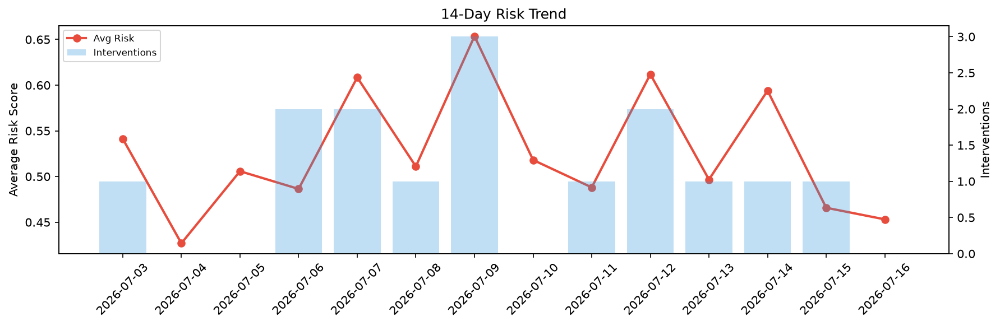

# Agent Improvement Report — 2026-07-16

**Cycle ID:** `a833c381` | **Avg Risk:** 0.4531 | **Interventions:** 0/4

## Risk Matrix

| Domain | Risk Score | Decision | Alerts |
|--------|-----------|----------|--------|
| code_review | 0.5968 | monitor | duplication |
| incident_response | 0.1264 | monitor | none |
| data_pipeline | 0.5766 | monitor | schema_drift |
| deployment | 0.5126 | monitor | none |

## Delta vs Yesterday

| Domain | Today | Yesterday | Change |
|--------|-------|-----------|--------|
| code_review | 0.5968 | 0.5802 | 📈 2.9% |
| incident_response | 0.1264 | 0.4504 | 📉 -71.9% |
| data_pipeline | 0.5766 | 0.6131 | 📉 -6.0% |
| deployment | 0.5126 | 0.2196 | 📈 133.4% |

**Refinement:** `{'adjustment': 'maintain', 'trend': 'improving', 'window': 4}`