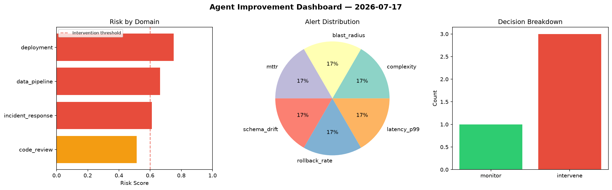
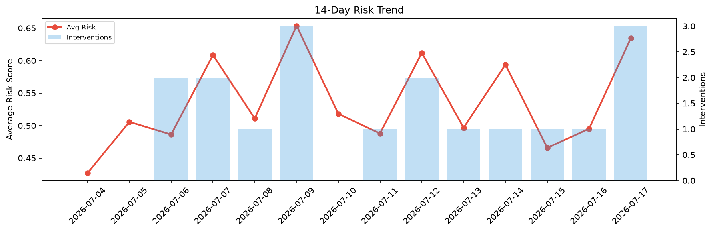

# Agent Improvement Report — 2026-07-17

**Cycle ID:** `105d60e6` | **Avg Risk:** 0.6345 | **Interventions:** 3/4

## Risk Matrix

| Domain | Risk Score | Decision | Alerts |
|--------|-----------|----------|--------|
| code_review | 0.5144 | monitor | complexity |
| incident_response | 0.6103 | intervene | blast_radius, mttr |
| data_pipeline | 0.663 | intervene | schema_drift |
| deployment | 0.7505 | intervene | rollback_rate, latency_p99 |

## Delta vs Yesterday

| Domain | Today | Yesterday | Change |
|--------|-------|-----------|--------|
| code_review | 0.5144 | 0.223 | 📈 130.7% |
| incident_response | 0.6103 | 0.7492 | 📉 -18.5% |
| data_pipeline | 0.663 | 0.5335 | 📈 24.3% |
| deployment | 0.7505 | 0.4753 | 📈 57.9% |

**Refinement:** `{'adjustment': 'tighten_thresholds', 'trend': 'degrading', 'window': 4}`