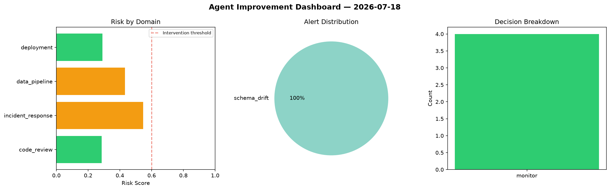
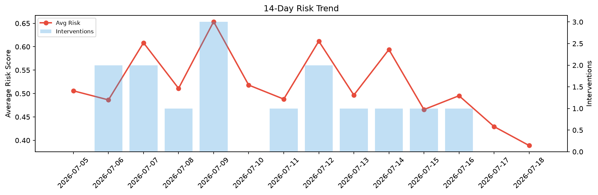

# Agent Improvement Report — 2026-07-18

**Cycle ID:** `5637cc11` | **Avg Risk:** 0.3889 | **Interventions:** 0/4

## Risk Matrix

| Domain | Risk Score | Decision | Alerts |
|--------|-----------|----------|--------|
| code_review | 0.2852 | monitor | none |
| incident_response | 0.5472 | monitor | none |
| data_pipeline | 0.4323 | monitor | schema_drift |
| deployment | 0.2909 | monitor | none |

## Delta vs Yesterday

| Domain | Today | Yesterday | Change |
|--------|-------|-----------|--------|
| code_review | 0.2852 | 0.5643 | 📉 -49.5% |
| incident_response | 0.5472 | 0.433 | 📈 26.4% |
| data_pipeline | 0.4323 | 0.2844 | 📈 52.0% |
| deployment | 0.2909 | 0.4359 | 📉 -33.3% |

**Refinement:** `{'adjustment': 'tighten_thresholds', 'trend': 'degrading', 'window': 4}`