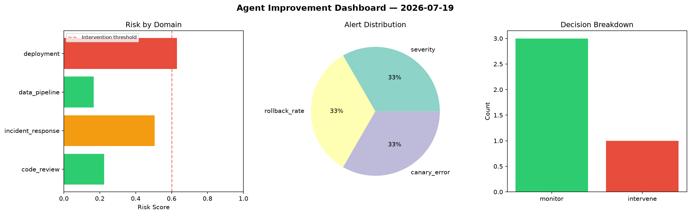
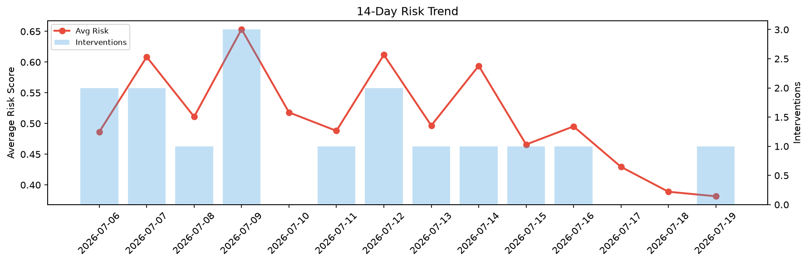

# Agent Improvement Report — 2026-07-19

**Cycle ID:** `c952d721` | **Avg Risk:** 0.3815 | **Interventions:** 1/4

## Risk Matrix

| Domain | Risk Score | Decision | Alerts |
|--------|-----------|----------|--------|
| code_review | 0.225 | monitor | none |
| incident_response | 0.5056 | monitor | severity |
| data_pipeline | 0.1658 | monitor | none |
| deployment | 0.6295 | intervene | rollback_rate, canary_error |

## Delta vs Yesterday

| Domain | Today | Yesterday | Change |
|--------|-------|-----------|--------|
| code_review | 0.225 | 0.2852 | 📉 -21.1% |
| incident_response | 0.5056 | 0.5472 | 📉 -7.6% |
| data_pipeline | 0.1658 | 0.4323 | 📉 -61.6% |
| deployment | 0.6295 | 0.2909 | 📈 116.4% |

**Refinement:** `{'adjustment': 'tighten_thresholds', 'trend': 'degrading', 'window': 4}`