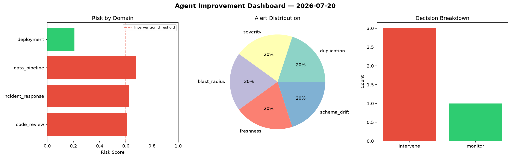
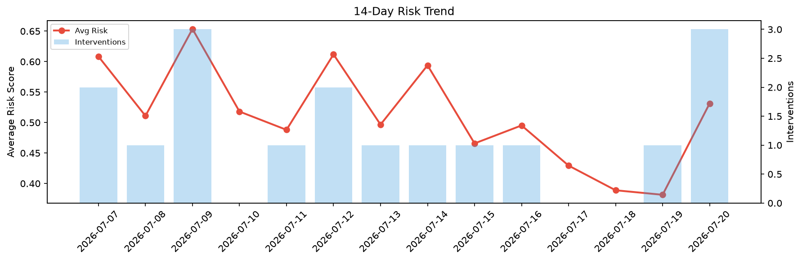

# Agent Improvement Report — 2026-07-20

**Cycle ID:** `65591e9d` | **Avg Risk:** 0.5314 | **Interventions:** 3/4

## Risk Matrix

| Domain | Risk Score | Decision | Alerts |
|--------|-----------|----------|--------|
| code_review | 0.611 | intervene | duplication |
| incident_response | 0.6267 | intervene | severity, blast_radius |
| data_pipeline | 0.68 | intervene | freshness, schema_drift |
| deployment | 0.2079 | monitor | none |

## Delta vs Yesterday

| Domain | Today | Yesterday | Change |
|--------|-------|-----------|--------|
| code_review | 0.611 | 0.225 | 📈 171.6% |
| incident_response | 0.6267 | 0.5056 | 📈 24.0% |
| data_pipeline | 0.68 | 0.1658 | 📈 310.1% |
| deployment | 0.2079 | 0.6295 | 📉 -67.0% |

**Refinement:** `{'adjustment': 'maintain', 'trend': 'improving', 'window': 4}`