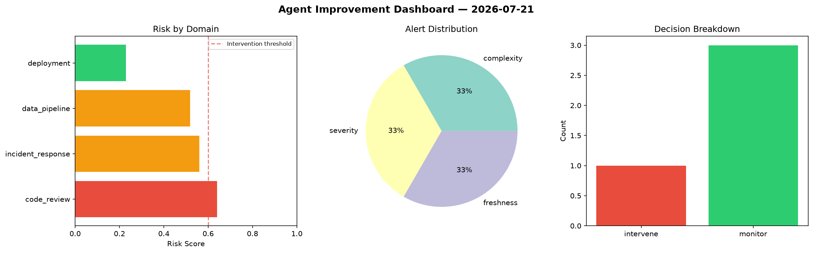
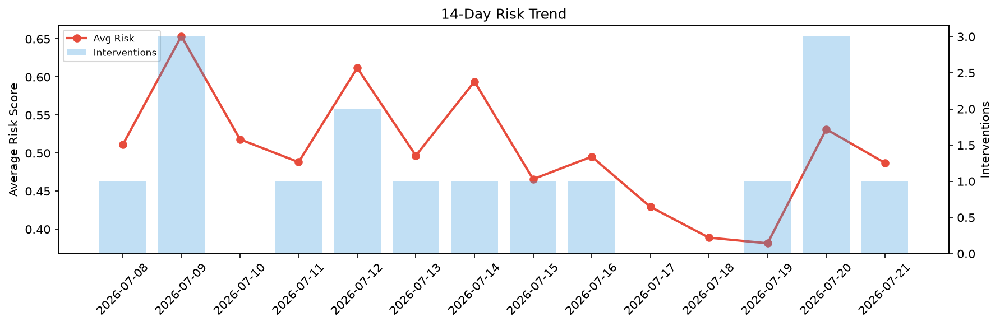

# Agent Improvement Report — 2026-07-21

**Cycle ID:** `e22bbbe2` | **Avg Risk:** 0.4872 | **Interventions:** 1/4

## Risk Matrix

| Domain | Risk Score | Decision | Alerts |
|--------|-----------|----------|--------|
| code_review | 0.64 | intervene | complexity |
| incident_response | 0.5608 | monitor | severity |
| data_pipeline | 0.5188 | monitor | freshness |
| deployment | 0.2291 | monitor | none |

## Delta vs Yesterday

| Domain | Today | Yesterday | Change |
|--------|-------|-----------|--------|
| code_review | 0.64 | 0.611 | 📈 4.7% |
| incident_response | 0.5608 | 0.6267 | 📉 -10.5% |
| data_pipeline | 0.5188 | 0.68 | 📉 -23.7% |
| deployment | 0.2291 | 0.2079 | 📈 10.2% |

**Refinement:** `{'adjustment': 'maintain', 'trend': 'improving', 'window': 4}`