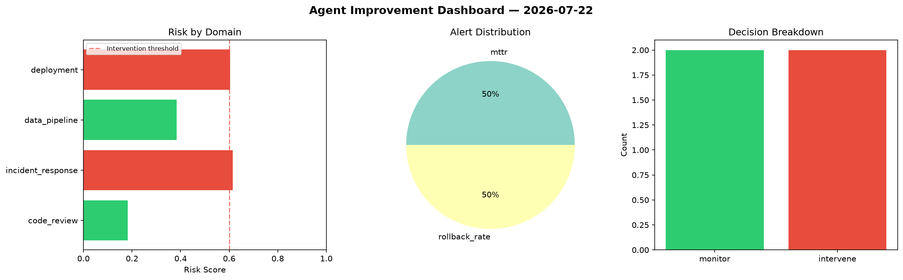
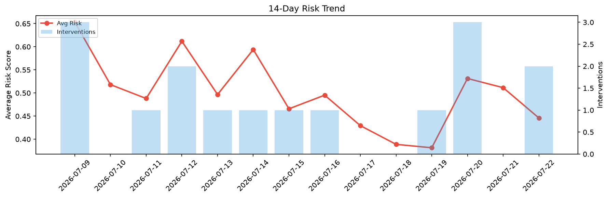

# Agent Improvement Report — 2026-07-22

**Cycle ID:** `233961d5` | **Avg Risk:** 0.446 | **Interventions:** 2/4

## Risk Matrix

| Domain | Risk Score | Decision | Alerts |
|--------|-----------|----------|--------|
| code_review | 0.1819 | monitor | none |
| incident_response | 0.6155 | intervene | mttr |
| data_pipeline | 0.3831 | monitor | none |
| deployment | 0.6033 | intervene | rollback_rate |

## Delta vs Yesterday

| Domain | Today | Yesterday | Change |
|--------|-------|-----------|--------|
| code_review | 0.1819 | 0.5823 | 📉 -68.8% |
| incident_response | 0.6155 | 0.448 | 📈 37.4% |
| data_pipeline | 0.3831 | 0.5269 | 📉 -27.3% |
| deployment | 0.6033 | 0.4887 | 📈 23.4% |

**Refinement:** `{'adjustment': 'tighten_thresholds', 'trend': 'degrading', 'window': 4}`