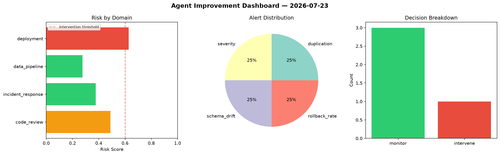
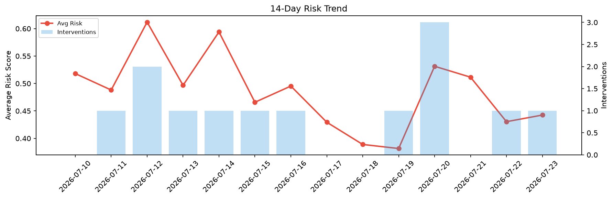

# Agent Improvement Report — 2026-07-23

**Cycle ID:** `197d2284` | **Avg Risk:** 0.4425 | **Interventions:** 1/4

## Risk Matrix

| Domain | Risk Score | Decision | Alerts |
|--------|-----------|----------|--------|
| code_review | 0.488 | monitor | duplication |
| incident_response | 0.377 | monitor | severity |
| data_pipeline | 0.2764 | monitor | schema_drift |
| deployment | 0.6285 | intervene | rollback_rate |

## Delta vs Yesterday

| Domain | Today | Yesterday | Change |
|--------|-------|-----------|--------|
| code_review | 0.488 | 0.0559 | 📈 773.0% |
| incident_response | 0.377 | 0.7449 | 📉 -49.4% |
| data_pipeline | 0.2764 | 0.5311 | 📉 -48.0% |
| deployment | 0.6285 | 0.3897 | 📈 61.3% |

**Refinement:** `{'adjustment': 'tighten_thresholds', 'trend': 'degrading', 'window': 4}`