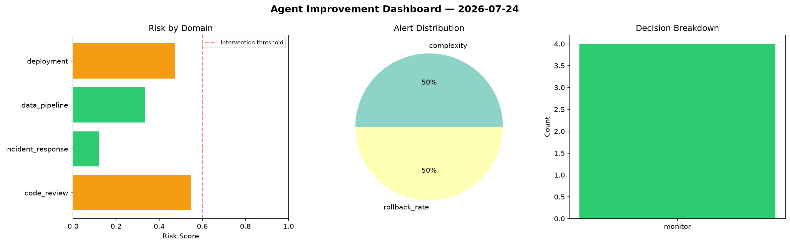
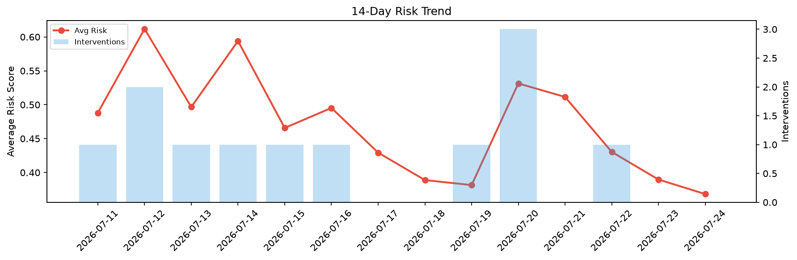

# Agent Improvement Report — 2026-07-24

**Cycle ID:** `bdb404fa` | **Avg Risk:** 0.3683 | **Interventions:** 0/4

## Risk Matrix

| Domain | Risk Score | Decision | Alerts |
|--------|-----------|----------|--------|
| code_review | 0.5463 | monitor | complexity |
| incident_response | 0.1194 | monitor | none |
| data_pipeline | 0.3353 | monitor | none |
| deployment | 0.4723 | monitor | rollback_rate |

## Delta vs Yesterday

| Domain | Today | Yesterday | Change |
|--------|-------|-----------|--------|
| code_review | 0.5463 | 0.3783 | 📈 44.4% |
| incident_response | 0.1194 | 0.1875 | 📉 -36.3% |
| data_pipeline | 0.3353 | 0.5072 | 📉 -33.9% |
| deployment | 0.4723 | 0.4857 | 📉 -2.8% |

**Refinement:** `{'adjustment': 'maintain', 'trend': 'improving', 'window': 4}`