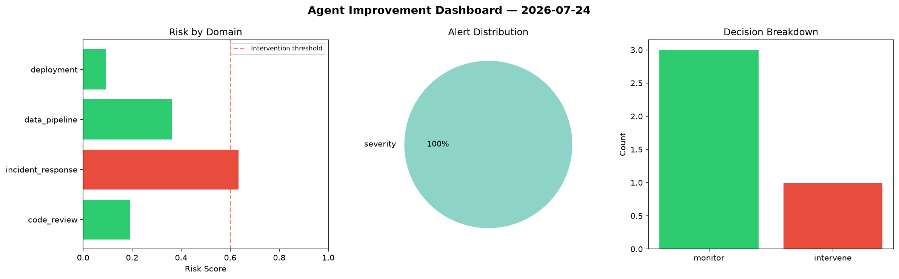
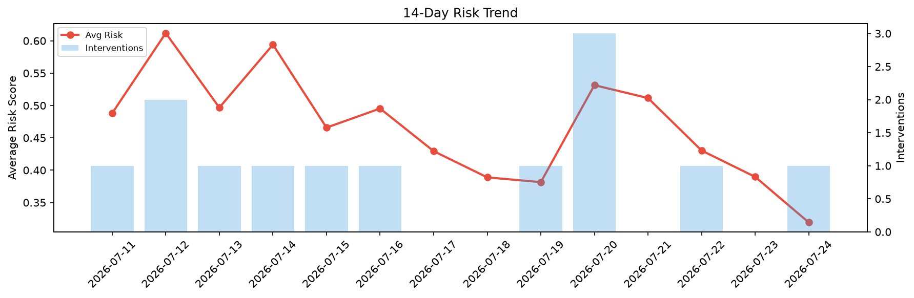

# Agent Improvement Report — 2026-07-24

**Cycle ID:** `fe907f57` | **Avg Risk:** 0.3193 | **Interventions:** 1/4

## Risk Matrix

| Domain | Risk Score | Decision | Alerts |
|--------|-----------|----------|--------|
| code_review | 0.19 | monitor | none |
| incident_response | 0.6337 | intervene | severity |
| data_pipeline | 0.3608 | monitor | none |
| deployment | 0.0927 | monitor | none |

## Delta vs Yesterday

| Domain | Today | Yesterday | Change |
|--------|-------|-----------|--------|
| code_review | 0.19 | 0.3783 | 📉 -49.8% |
| incident_response | 0.6337 | 0.1875 | 📈 238.0% |
| data_pipeline | 0.3608 | 0.5072 | 📉 -28.9% |
| deployment | 0.0927 | 0.4857 | 📉 -80.9% |

**Refinement:** `{'adjustment': 'maintain', 'trend': 'improving', 'window': 4}`