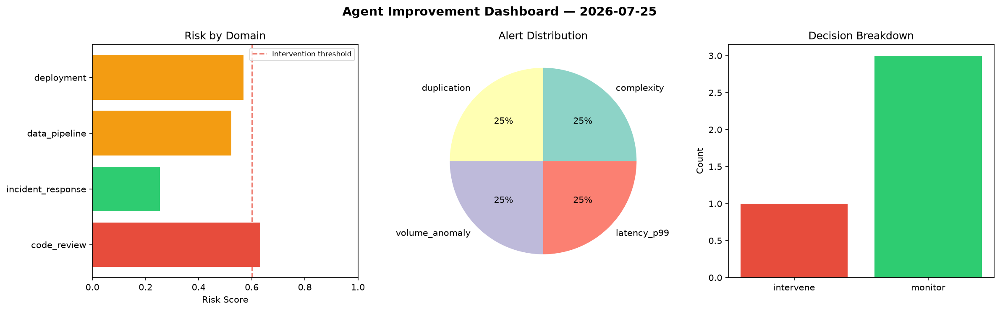
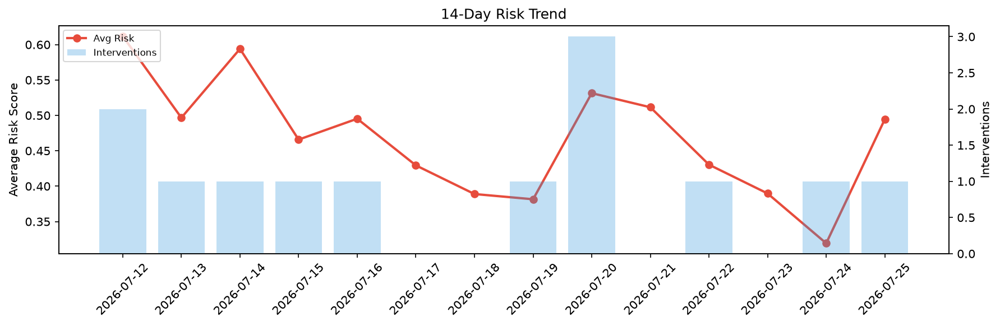

# Agent Improvement Report — 2026-07-25

**Cycle ID:** `ae143a44` | **Avg Risk:** 0.4946 | **Interventions:** 1/4

## Risk Matrix

| Domain | Risk Score | Decision | Alerts |
|--------|-----------|----------|--------|
| code_review | 0.6327 | intervene | complexity, duplication |
| incident_response | 0.2537 | monitor | none |
| data_pipeline | 0.523 | monitor | volume_anomaly |
| deployment | 0.569 | monitor | latency_p99 |

## Delta vs Yesterday

| Domain | Today | Yesterday | Change |
|--------|-------|-----------|--------|
| code_review | 0.6327 | 0.19 | 📈 233.0% |
| incident_response | 0.2537 | 0.6337 | 📉 -60.0% |
| data_pipeline | 0.523 | 0.3608 | 📈 45.0% |
| deployment | 0.569 | 0.0927 | 📈 513.8% |

**Refinement:** `{'adjustment': 'maintain', 'trend': 'improving', 'window': 4}`