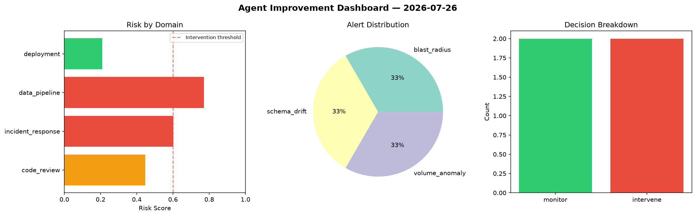
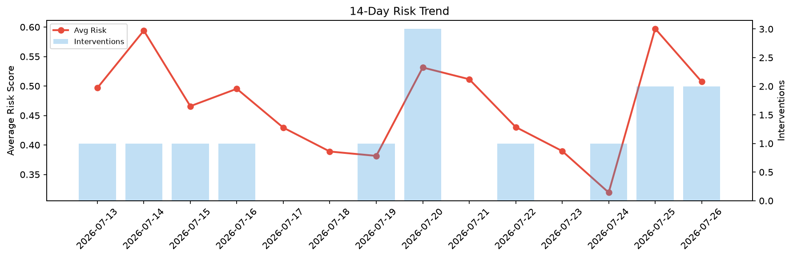

# Agent Improvement Report — 2026-07-26

**Cycle ID:** `b17d8b0e` | **Avg Risk:** 0.5073 | **Interventions:** 2/4

## Risk Matrix

| Domain | Risk Score | Decision | Alerts |
|--------|-----------|----------|--------|
| code_review | 0.4459 | monitor | none |
| incident_response | 0.602 | intervene | blast_radius |
| data_pipeline | 0.771 | intervene | schema_drift, volume_anomaly |
| deployment | 0.2102 | monitor | none |

## Delta vs Yesterday

| Domain | Today | Yesterday | Change |
|--------|-------|-----------|--------|
| code_review | 0.4459 | 0.8827 | 📉 -49.5% |
| incident_response | 0.602 | 0.5617 | 📈 7.2% |
| data_pipeline | 0.771 | 0.7518 | 📈 2.6% |
| deployment | 0.2102 | 0.1928 | 📈 9.0% |

**Refinement:** `{'adjustment': 'maintain', 'trend': 'improving', 'window': 4}`