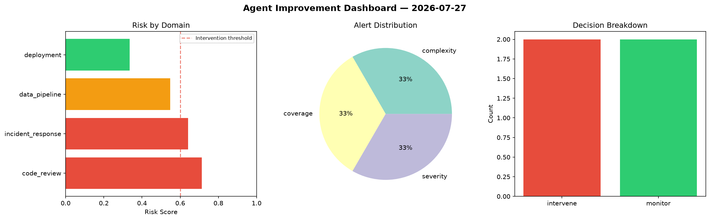
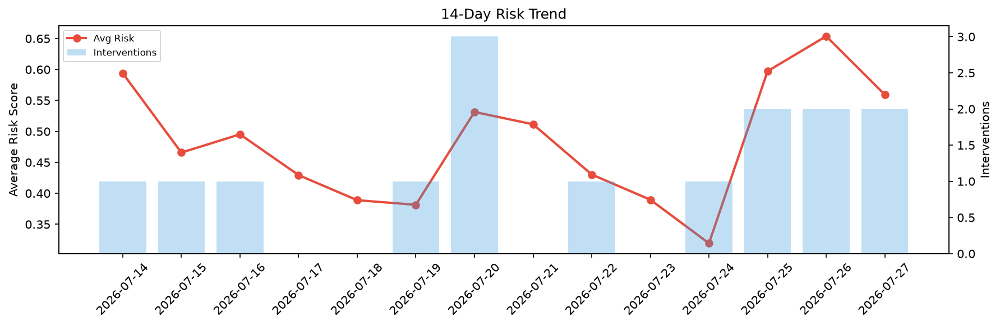

# Agent Improvement Report — 2026-07-27

**Cycle ID:** `2cabf618` | **Avg Risk:** 0.5594 | **Interventions:** 2/4

## Risk Matrix

| Domain | Risk Score | Decision | Alerts |
|--------|-----------|----------|--------|
| code_review | 0.7136 | intervene | complexity, coverage |
| incident_response | 0.641 | intervene | severity |
| data_pipeline | 0.548 | monitor | none |
| deployment | 0.3348 | monitor | none |

## Delta vs Yesterday

| Domain | Today | Yesterday | Change |
|--------|-------|-----------|--------|
| code_review | 0.7136 | 0.7913 | 📉 -9.8% |
| incident_response | 0.641 | 0.5887 | 📈 8.9% |
| data_pipeline | 0.548 | 0.3528 | 📈 55.3% |
| deployment | 0.3348 | 0.8823 | 📉 -62.1% |

**Refinement:** `{'adjustment': 'maintain', 'trend': 'improving', 'window': 4}`