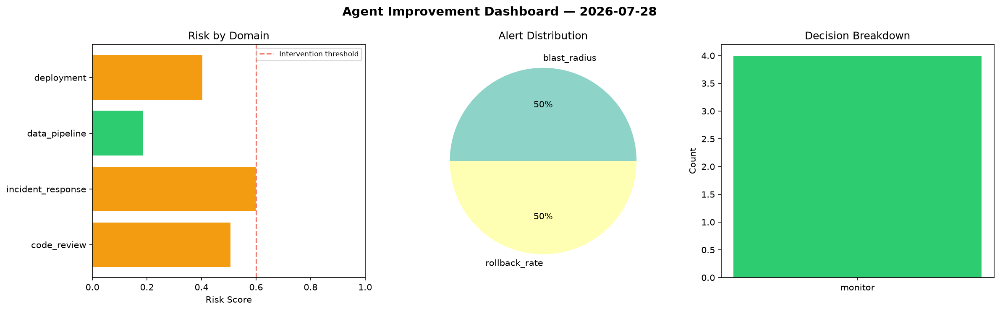
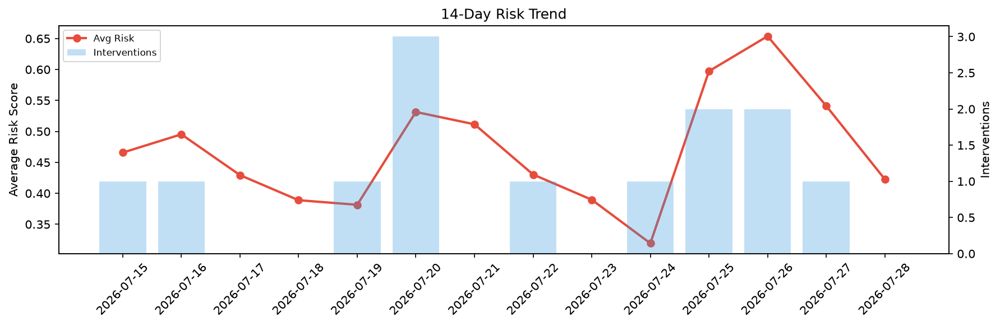

# Agent Improvement Report — 2026-07-28

**Cycle ID:** `ef9fb22e` | **Avg Risk:** 0.4228 | **Interventions:** 0/4

## Risk Matrix

| Domain | Risk Score | Decision | Alerts |
|--------|-----------|----------|--------|
| code_review | 0.5055 | monitor | none |
| incident_response | 0.5982 | monitor | blast_radius |
| data_pipeline | 0.184 | monitor | none |
| deployment | 0.4034 | monitor | rollback_rate |

## Delta vs Yesterday

| Domain | Today | Yesterday | Change |
|--------|-------|-----------|--------|
| code_review | 0.5055 | 0.5751 | 📉 -12.1% |
| incident_response | 0.5982 | 0.4472 | 📈 33.8% |
| data_pipeline | 0.184 | 0.7277 | 📉 -74.7% |
| deployment | 0.4034 | 0.4152 | 📉 -2.8% |

**Refinement:** `{'adjustment': 'maintain', 'trend': 'improving', 'window': 4}`