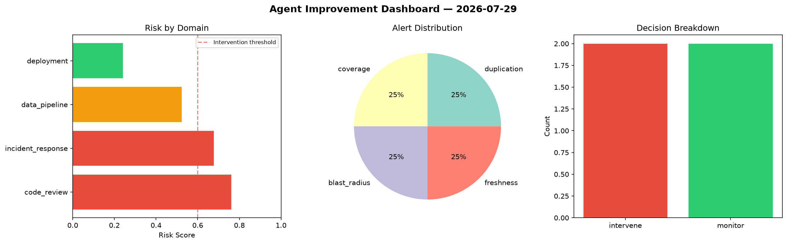
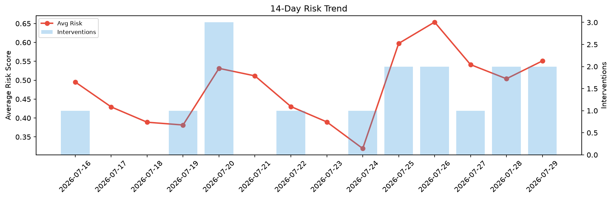

# Agent Improvement Report — 2026-07-29

**Cycle ID:** `429512fc` | **Avg Risk:** 0.5511 | **Interventions:** 2/4

## Risk Matrix

| Domain | Risk Score | Decision | Alerts |
|--------|-----------|----------|--------|
| code_review | 0.7614 | intervene | duplication, coverage |
| incident_response | 0.6777 | intervene | blast_radius |
| data_pipeline | 0.5239 | monitor | freshness |
| deployment | 0.2416 | monitor | none |

## Delta vs Yesterday

| Domain | Today | Yesterday | Change |
|--------|-------|-----------|--------|
| code_review | 0.7614 | 0.3756 | 📈 102.7% |
| incident_response | 0.6777 | 0.6882 | 📉 -1.5% |
| data_pipeline | 0.5239 | 0.6615 | 📉 -20.8% |
| deployment | 0.2416 | 0.2903 | 📉 -16.8% |

**Refinement:** `{'adjustment': 'maintain', 'trend': 'improving', 'window': 4}`