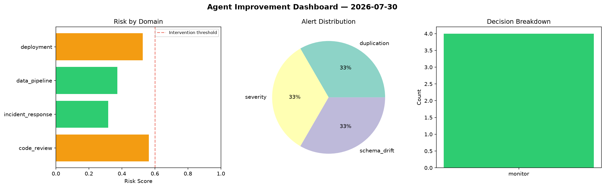
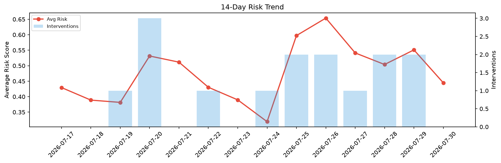

# Agent Improvement Report — 2026-07-30

**Cycle ID:** `7b532d01` | **Avg Risk:** 0.4448 | **Interventions:** 0/4

## Risk Matrix

| Domain | Risk Score | Decision | Alerts |
|--------|-----------|----------|--------|
| code_review | 0.5637 | monitor | duplication |
| incident_response | 0.3175 | monitor | severity |
| data_pipeline | 0.372 | monitor | schema_drift |
| deployment | 0.5261 | monitor | none |

## Delta vs Yesterday

| Domain | Today | Yesterday | Change |
|--------|-------|-----------|--------|
| code_review | 0.5637 | 0.7614 | 📉 -26.0% |
| incident_response | 0.3175 | 0.6777 | 📉 -53.2% |
| data_pipeline | 0.372 | 0.5239 | 📉 -29.0% |
| deployment | 0.5261 | 0.2416 | 📈 117.8% |

**Refinement:** `{'adjustment': 'maintain', 'trend': 'improving', 'window': 4}`