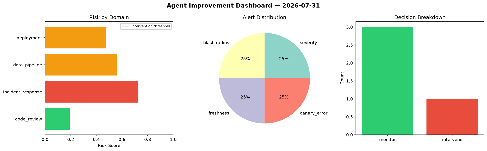
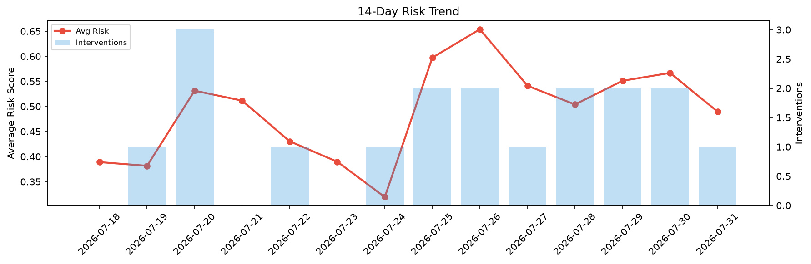

# Agent Improvement Report — 2026-07-31

**Cycle ID:** `16d76502` | **Avg Risk:** 0.4897 | **Interventions:** 1/4

## Risk Matrix

| Domain | Risk Score | Decision | Alerts |
|--------|-----------|----------|--------|
| code_review | 0.1934 | monitor | none |
| incident_response | 0.7288 | intervene | severity, blast_radius |
| data_pipeline | 0.5589 | monitor | freshness |
| deployment | 0.4776 | monitor | canary_error |

## Delta vs Yesterday

| Domain | Today | Yesterday | Change |
|--------|-------|-----------|--------|
| code_review | 0.1934 | 0.7405 | 📉 -73.9% |
| incident_response | 0.7288 | 0.3241 | 📈 124.9% |
| data_pipeline | 0.5589 | 0.4734 | 📈 18.1% |
| deployment | 0.4776 | 0.7293 | 📉 -34.5% |

**Refinement:** `{'adjustment': 'tighten_thresholds', 'trend': 'degrading', 'window': 4}`