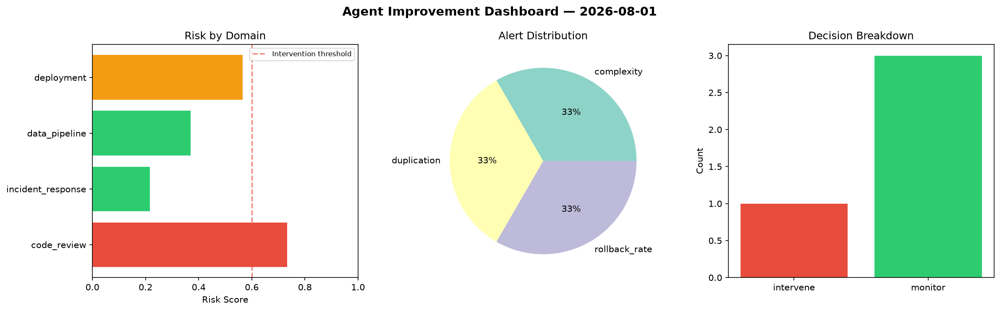
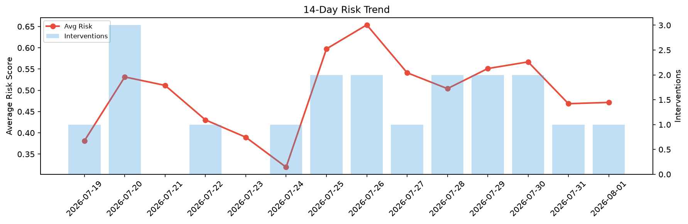

# Agent Improvement Report — 2026-08-01

**Cycle ID:** `df464ee0` | **Avg Risk:** 0.4715 | **Interventions:** 1/4

## Risk Matrix

| Domain | Risk Score | Decision | Alerts |
|--------|-----------|----------|--------|
| code_review | 0.7335 | intervene | complexity, duplication |
| incident_response | 0.2171 | monitor | none |
| data_pipeline | 0.3704 | monitor | none |
| deployment | 0.565 | monitor | rollback_rate |

## Delta vs Yesterday

| Domain | Today | Yesterday | Change |
|--------|-------|-----------|--------|
| code_review | 0.7335 | 0.3905 | 📈 87.8% |
| incident_response | 0.2171 | 0.2604 | 📉 -16.6% |
| data_pipeline | 0.3704 | 0.6661 | 📉 -44.4% |
| deployment | 0.565 | 0.557 | 📈 1.4% |

**Refinement:** `{'adjustment': 'maintain', 'trend': 'improving', 'window': 4}`