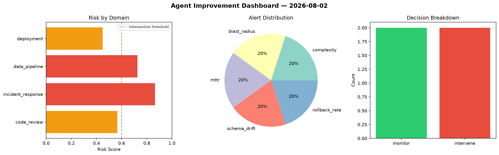
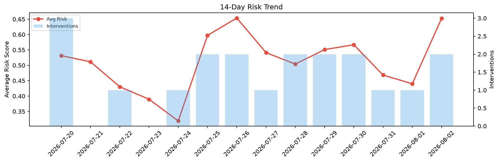

# Agent Improvement Report — 2026-08-02

**Cycle ID:** `3f592a26` | **Avg Risk:** 0.6523 | **Interventions:** 2/4

## Risk Matrix

| Domain | Risk Score | Decision | Alerts |
|--------|-----------|----------|--------|
| code_review | 0.5668 | monitor | complexity |
| incident_response | 0.8662 | intervene | blast_radius, mttr |
| data_pipeline | 0.7263 | intervene | schema_drift |
| deployment | 0.4498 | monitor | rollback_rate |

## Delta vs Yesterday

| Domain | Today | Yesterday | Change |
|--------|-------|-----------|--------|
| code_review | 0.5668 | 0.3174 | 📈 78.6% |
| incident_response | 0.8662 | 0.305 | 📈 184.0% |
| data_pipeline | 0.7263 | 0.3808 | 📈 90.7% |
| deployment | 0.4498 | 0.7564 | 📉 -40.5% |

**Refinement:** `{'adjustment': 'maintain', 'trend': 'improving', 'window': 4}`